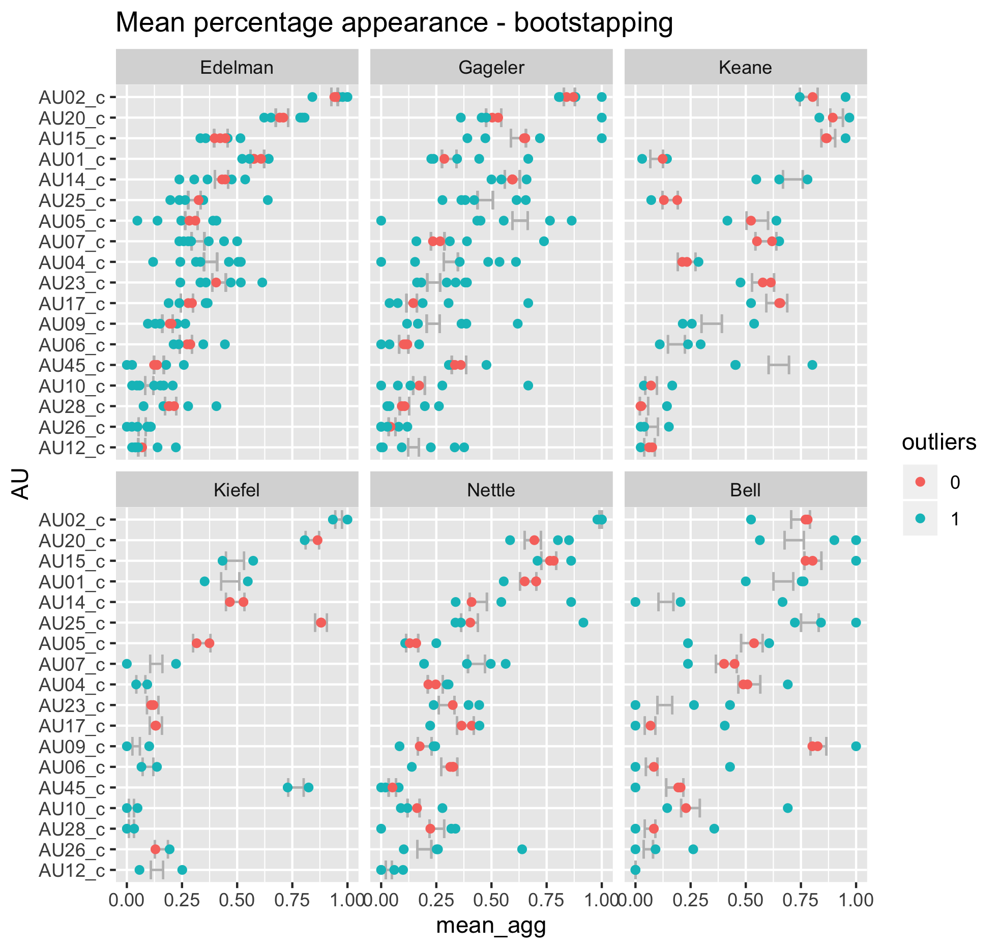

```{r setup, include=FALSE}
knitr::opts_chunk$set(echo = FALSE, warning = FALSE, message = FALSE)

library(tidyverse)
library(ggpubr)
load("raw_data/au_tidy.rda")
```


## Stage 1: Data collecting

### 1.1 Data processing

The source data of the project are videos from the high court of Australia (http://www.hcourt.gov.au/cases/recent-av-recordings). Turning the video information into tidy facial data can be summarised through the following workflow: 


The relevant R code can be found in [2.Magick & OpenFace.Rmd](https://github.com/huizezhang-sherry/ETC4860/blob/master/2.Magick%20%26%20OpenFace.Rmd), [2.ffmpeg.Rmd](https://github.com/huizezhang-sherry/ETC4860/blob/master/2.ffmpeg.Rmd) and [3.0csv_proessing.Rmd](https://github.com/huizezhang-sherry/ETC4860/blob/master/3.0csv_processing.Rmd).


### 1.2 Variable description

OpenFace provides more than 700 variables measuring different aspect of a given face and a full description of the output variables can be found [here](https://github.com/TadasBaltrusaitis/OpenFace/wiki/Action-Units). This outlines the difficulty of this project: no existing models will present accurate prediction and inference using 700+ variables - how can we incorporate these information to say about the facial expressions of the Justices during the hearings? 

I conduct some exploratory data analysis on one video: `Nauru_a` and find the 700+ variables can be classified as follows with some insights

 - **Confidence**: How confidence OpenFace is with the detection. Confidence is related to the angle that the Justice’s face present in the images. 
 
 - **Gaze**: Gaze tracking: the vector from the pupil to corneal reflection. The dataset contains information on the gaze for both eyes while there is no distinct difference between the eyes. Also I was trying to make animation to track the change of the gaze for judges but no good luck. 
 
 - **Pose**: the location of the head with respect to camera. Pose-related variables don't provide much useful information apart from gaze-related variables. 
 
 - **Landmarking**: landmarking variables for face and eyes. Landmarking variables allows me to plot the face of the judge in a particular frame. More work could be done to explore the usefulness of landmarking variables. 
 
 - **Action Unit**: Action units are used to describe facial expressions. [this website](https://imotions.com/blog/facial-action-coding-system/) provides a good animation on each action unit. The action unit has intensity measures ending with `_c` and presence measures ending with `_r`. These variables will be the focus of my project and a reference study of using action units to detect human emotion by Kovalchik can be found [here](http://www.sloansportsconference.com/wp-content/uploads/2018/02/2005.pdf). 
 
R markdown document [3.2EDA_nauru_a.Rmd](https://github.com/huizezhang-sherry/ETC4860/blob/master/3.2EDA_nauru_a.Rmd) records the analysis above. An extension to the full video EDA can be bound [here](https://github.com/huizezhang-sherry/ETC4860/blob/master/3.3EDA.Rmd). 
 

### 1.3 Missing value imputation 

The missingness in the dataset could be due to the fact that a judge is reading the materials on the desk so the face is not captured for a particular frame or simply because some faces are not detectable for the given resolution of the video stream. However, since that data is in time series structure, simply drop the missing observation will cause the time interval to be irregular and complicate further analysis. 

There are two different sets of variables that need imputation. `Presence` is a binary variable that takes value of one if an action unit is present in a particular frame for a judge in a video and `Intensity` measures how strong that action unit is. Linear interpolation from `forecast` package is suitable to impute `Intensity` and `Presence` is imputed through sampling from binomial distribution. The imputed action unit data is stored as `au_imputed` under the `raw_data` folder. 

### 1.4 Data quality

There is a data quality issue coming from the data I get from OpenFace. For some observations, the intensity of the action unit could be high while the present variable has a zero value. This does not make sense since if an action unit has been detected as strong intensity for a judge in a particular frame, it should at least present on the judge's face. Therefore, I adjust for the presence value if the intensity is higher than one. One is being chosen as the threshold value since in Ekman's definition of the intensity of the action unit, a score of one means the action unit is at least slightly present in the judge's face. The adjusted data is stored as `au_tidy` under the `raw_data` folder. 

The above two sections are documented in [3.1missing.Rmd](https://github.com/huizezhang-sherry/ETC4860/blob/master/3.1missing.Rmd). 


### 1.5 Text Analysis 

Text analysis conducted using the transcript strapped from the high court of Australia to study the interruptions by the justices. This is used as a benchmark to compare if facial information could help to understand more about Justices' decisions. See [3.5text&outcome.R](https://github.com/huizezhang-sherry/ETC4860/blob/master/3.5%20text%26outcome.R) for more details. 
 
## Stage 2: Exploratory Data Analysis

### 2.1 Data Structure

The $Y$ variable in our case is multivariate including `Presence` and `Intensity` and it can be written in matrix notation as 


\begin{aligned}
Y_{jitk} = 
\begin{bmatrix}
P_{ijtk} \\
I_{ijtk}
\end{bmatrix}
\end{aligned}


There are four layers of indexs, which are defined as follows 

- $i$ for `judge_id` and $i = 1,2, \cdots, 6$
- $j$ for `video_id` and $j = 1,2, \cdots, 7$
- $t$ for `frame_id` and $t = 1,2, \cdots, T_j$
- $k$ for `au_id` and available action unit includes `r unique(au_tidy$AU)`. Notice that OpenFace doesnt provide intensity score for AU28. 

[this may belong to the modelling part]
Assuming all the facial information can be summarised as a `Y` variable with multiple indices $(i,j,t,k)$. We can summarise the information via a linear combination of variables as 

$$Y_{ijtk} = \mu + \alpha_i + \beta_j + \gamma_t + \delta_k + CP_2(\alpha_i, \beta_j, \gamma_t, \delta_k) + CP_3(\alpha_i, \beta_j, \gamma_t, \delta_k)]$$

where 

- $CP_2$ is the all possible interaction of the two variables
- $CP_3$ is the all possible interaction of the three variables


### 2.2 What can we learn from the presence variable of the action unit?  
 
 
#### 2.2.1 Mean presence 

The plot gives an overview of the presence of all the action unit across all the judge. The statistic each bar represents is the average presence of an action unit for a judge throughout all the video time and it can be written as $$P_{ik} = \frac{\sum_{jt}X_{ijtk}}{\sum_{j = 1}^JT_j}$$. The order of Action unit on the y axis is ranked by the average presence of all the judge, which can be re-presented as $P_{* K}$. 

```{r}
# Because each judge has different numbers of frame available, mean is a better way ,than sum/ count,  to discribe the frequency of occurence. 

most_common <- au_tidy %>% 
  group_by(judge_id,AU) %>% 
  summarise(avg_presence = mean(presence)) %>% 
  filter(avg_presence != "NaN") %>% 
  group_by(judge_id) %>% 
  arrange(-avg_presence) %>% 
  mutate(common = row_number()) %>% 
  mutate(most_common = as_factor(ifelse(common <=5, 1, 0))) 

most_common %>% 
  ggplot(aes(x =  fct_reorder(AU, avg_presence), y = avg_presence,
         fill = most_common, col = most_common)) + 
  geom_col() +
  xlab("AU") + 
  ylab("Average Presence") + 
  facet_wrap(vars(judge_id)) + 
  coord_flip() + 
  theme(legend.position = "none")

#ggsave(filename = "images/most_common_au.png")
```

The most frequent displayed action unit is highlighed in blue for each judge and summarised in the table below. 

```{r}
# in a table format
knitr::kable(most_common %>% 
  filter(most_common ==1) %>% 
  select(-c(common, most_common, avg_presence)) %>% 
  mutate(index = row_number()) %>% 
  spread(judge_id, AU))
```

It can be seen that some of the action units are common across almost all the judges, these includes 

- AU02 (outer eyebrow raise), 
- AU20 (lip stretcher), 
- AU15 (Lip Corner Depressor) and 
- AU14 (Dimpler)

The table below summarises the judge specific high frequent action units.

```{r}
other_highf <- most_common %>% 
  filter(most_common ==1) %>% 
  select(-c(common, most_common, avg_presence)) %>% 
  filter(!AU %in% c("AU02", "AU20", "AU15", "AU14")) %>% 
  mutate(index = row_number()) %>% 
  spread(index, AU) %>% 
  rename(first = `1`, second = `2`) 
  

knitr::kable(other_highf)
```

These are the results from inspecting the action units visually and they should also be reflected thorugh the coefficients of the relevant models [see stage 3 modelling]. 

#### 2.2.1 Presence by videos

Apart from visualising the general presence score for all the action unit, we are also interested in the break down statistics by video.  The statistics being plotted is thus $$P_{ijk} = \frac{\sum_{t}X_{ijtk}}{T_j}$$ with selected most common four action units. From this plot, it is interesting to know that almost all the judges have more frequent action units on the face for case OKS. This maybe related to the nature of the case... 


```{r}
most_common_subset <- most_common %>% 
  filter(most_common == 1) %>% 
  mutate(index = paste0(judge_id,AU))

more_presence <- au_tidy %>% 
  group_by(judge_id,AU, video_id) %>% 
  summarise(avg_presence = mean(presence)) %>% 
  filter(avg_presence != "NaN") %>% 
  arrange(-avg_presence) %>% 
  mutate(index = paste0(judge_id,AU)) %>% 
  filter(index %in% most_common_subset$index) 
  
more_presence %>% 
  filter(AU %in% c("AU02", "AU14", "AU15", "AU20")) %>% 
  ggplot(aes(x = video_id, y = avg_presence, 
             group = judge_id, col = judge_id)) + 
  geom_line() + 
  geom_point() + 
  facet_wrap(vars(AU),scales = "free_x") + 
  theme(axis.text.x = element_text(angle = 30, hjust = 1))

```


### 2.3 What can we learn from the intensity variable of the action unit? 

### 2.3.1 General Intensity  plot

The plot gives an overview of the action unit intensity of all the judges across all the trails. Each bar-and-whisker represents the intensity of all the action units aggregated on time for a particular judge in a specific case. For example, the first bar-and-whisker in case Nauru_a is created using all the 17 action units of Edelman through out the elapsed time in Nauru_a case. In mathematics notation, the plotted statistics is $I_{ijtk}$ seperating by $i \text{and} j$. 

In Ekman's 20002 FACS manual, the intensity of Action unit is defined based on five classes: Trace(1), Slight(2), Marked or pronounced(3), Severe or extreme(4) and Maximum(5). From the plot, most of the action units have low intensity (almost zero average and lower than one upper bounds) and this is expected because usually in the court room, judges are expected to behave neutral. From this plot, we can see that Judge Bell doesn't seem to have many intensive expressions as we can see from the relatively small amount of dots in the whisker.  

To better look at the mean of each boxplot, we take a square root transformation and hide the outliners into the upper line. We can find that Judge Nettle seems to have higher average in all the four cases he appears: Nauru_a&b, Rinehart_a &b. 

```{r fig.height=5, fig.width=7}
au_intensity_all <- au_tidy %>% 
  mutate(is_intense = ifelse(intensity >= 2, 1, 0))  

# intensity plot
au_intensity_all %>% 
  ggplot(aes(x = judge_id, y = intensity, color = judge_id)) + 
  geom_boxplot() + 
  facet_wrap(vars(video_id), scales = "free_x") + 
  theme(axis.text.x = element_text(angle = 30, hjust = 1), 
        legend.position = "none")
#ggsave("images/I_overall.png",width = 7, height = 5)  

# the plot magnify the box
au_intensity_all %>% 
  ggplot(aes(x = judge_id, y = intensity, color = judge_id)) + 
  geom_boxplot(coef = 100) + 
  facet_wrap(vars(video_id), scales = "free_x") + 
  theme(axis.text.x = element_text(angle = 30, hjust = 1), 
        legend.position = "none") + 
  scale_y_sqrt()
#ggsave("images/I_sqrt.png",width = 7, height = 5)

``` 
 
### 2.3.2 Mean intensity 

We compute a similar mean intensity score for each of the action unit for each of the judge, the statsitics is $$I_{ik} = \frac{\sum_{jt}X_{ijtk}}{\sum_{j = 1}^JT_j}$$. Less uniform as the mean presence plot - different judge response intense at different action units. 

```{r}
au_intensity_all %>% 
  filter(!AU == "AU28") %>%  # AU28 doesnt have intensity score
  group_by(judge_id, AU) %>% 
  summarise(mean_intensity = mean(intensity, na.rm = TRUE)) %>% 
  arrange(-mean_intensity) %>% 
  mutate(index = row_number(), 
         most_intense = as.factor(ifelse(index <= 5, 1,0))) %>% 
  ggplot(aes(x = fct_reorder(AU, mean_intensity), 
             y = mean_intensity, 
             fill = most_intense)) + 
  geom_col() + 
  facet_wrap(vars(judge_id)) + 
  coord_flip()
```  
 
### 2.3.3 Intensity plot for the most frequent action units
 
Apart from visualising the general intensity score for all the action unit, we are also interested in the intensity score of the most frequent units. The statistics being plotted is thus $I_{ij*k}$ with selected $i$ indicated by the `most_common` table above. Five most frequent action units for each of the six judges give 30 subplots and I arrange them into two seperate plots: Intensity for four major high frequent action units and Intensity for other high frequent action units. 

From the first plot, some panels are empty for some judges. This is because the particular action unit is not the most frequent five for that particular judge. We can learn that AU02, although being commonly detected for all the judges, the intensity is quite low. 

From the second plot, most of the intensity are low as the general intensity plot, while one action unit has drawn the attention: AU45 for Kiefel. The intensity in both case parkes and case Rinehart_a for Kiefel are relatively higher than others and this will be reflected through our model. 

```{r}
most_common_subset <- most_common %>% 
  filter(most_common == 1) %>% 
  mutate(index = paste0(judge_id,AU))

intensity_subset <- au_intensity_all %>% 
  mutate(index = paste0(judge_id,AU)) %>% 
  filter(index %in% most_common_subset$index) 

# plot for four major high frequent action units
intensity_subset %>% 
  filter(AU %in% c("AU02", "AU14", "AU15", "AU20")) %>% 
  ggplot(aes(x = video_id, y = intensity, col = video_id)) + 
  geom_boxplot() + 
  facet_grid(rows = vars(AU),
             cols = vars(judge_id), scales = "free_x") + 
  theme(legend.position = "none",
        axis.text.x = element_text(angle = 30, hjust = 1))

# plot for other high frequent action units
intensity_subset_plot <- function(judge){
  intensity_subset %>% 
    filter(!AU %in% c("AU02", "AU14", "AU15", "AU20")) %>% 
    filter(judge_id == judge) %>% 
    ggplot(aes(x = video_id, y = intensity, col = video_id)) + 
    geom_boxplot() + 
    facet_grid(rows = vars(judge_id),
               cols = vars(AU), scales = "free_x") + 
    ylim(c(0,4)) + 
    theme(legend.position = "none",
          axis.text.x = element_text(angle = 30, hjust = 1))
}

  
judge <- unique(intensity_subset$judge_id)
subplot <- map(judge, intensity_subset_plot)  


ggarrange(subplot[[1]], 
          subplot[[2]],
          subplot[[5]],
          subplot[[6]],
          subplot[[3]],
          subplot[[4]],
          ncol = 2, nrow = 3)

```
 
### 2.3.4 High intensity points

We filter out the points have intensity greater than 2  (at least "slight" as per Ekman) in the previous plot and plot it against time and color by the speaker. It tells us that Edelman, Gageler and Nettle are the judges have stronger emotion that can be detected (since they have more points with intensity greater than 2). Different judges also have different time where they display stronger emotions. For example, Justice Nettle are more likely to have stronger emotion throughout the time when the appellant is speaking but only at the beginning and ending period when the respondent is speaking.

```{r}
au_intensity_all %>% filter(is_intense ==1) %>% 
  ggplot(aes(x = frame_id, y = intensity, col = speaker)) + 
  geom_point() +
  facet_wrap(vars(judge_id))
```

## Stage 3: Modelling


## Stage 4: Action unit within judge 

In this section, I use bootstrap simulation to answer the question 

- ***Does each Justice behave consistently in different trails or not?***

### AU presence 

I first use simulation method to find the "normal" percentage of appearance of each AU for each Justices. The simulated mean percentage is then compared with the mean percentage appearance of each individual video to determine if an action unit appears considerably more or less than the "normal" level for each justices. The simulation and comparison procedure can be summarised as follows 

- Step 1: Compute the simulated mean percentage appearance $\mu_{(i,k)}$ for each pair of $(i,k)$ using bootstrapping and binomial distribution. Below is an illustration of how bootstrap simulation is applied for *one particular* Justices-AU pair $(i,k)$

  - The replicates $(r_1, r_2, \cdots, r_n)$ for bootstrap simulation are drawn from !$$x_{(i,1,1,k)}, x_{(i,1,2,k)}, \cdots, x_{(i,1,T,k)},\cdots, x_{(i,J,1,k)},x_{(i,J,2,k)},  \cdots,x_{(i,J,T,k)}$$ 
  
  - The statistics to compute is the mean percentage $\mu_{(i,k)} = \frac{1}{n}\sum_{i = 1}^n r_i$

  - Simulation result for all Justices-AU pair can be written in the matrix notation as 

$$
\begin{bmatrix}
\mu_{(1,1)} & \cdots & \mu_{(1,k)} \\
\mu_{(2,1)} & \cdots & \mu_{(2,k)} \\
\vdots  && \vdots \\
\mu_{(6,1)}  & \cdots & \mu_{(6,k)} \\
\end{bmatrix}
$$


- Step 2: Compute the mean percentage appearance of each individual video $\frac{1}{T} \sum_{t = 1}^T x_{(i,j,t,k)}$for each combination of $(i, j, k)$

The simulation result is presented below. We expect the simulated interval will be able to include most of the points and the very few outliers would indicate a judge is behaving abnormal in a particular trail. However, what we see here is most of the points are outside the interval. This means that judges behave very different from video to video and thus a simulated overall mean is not very representative of the each individual mean appearance. 

. 


### AU Intensity

Todo: 
 - fill in this part 

## Stage 5: Action unit between Judge 

In this section, I use principle component analysis (PCA) to answer the question 

- ***Does the judges behave the same or different from one to another?***

Apart from understand how each Justice behaves consistently or not across all the videos, we are also interested in comparing *across* all the Justices to study who are more animated than others during the hearings. Time index is averaged for each judge and video pair and mathmetically, the matrix supplied to the PCA algorithm can be represented as follows. 

$$\begin{aligned}
\begin{bmatrix}
x_{1,1,\bar{t},1} & x_{1,1,\bar{t},2} & \cdots & x_{1,1,\bar{t},K}\\
x_{1,2,\bar{t},1} & x_{1,2,\bar{t},2} & \cdots & x_{1,2,\bar{t},K}\\
\vdots & \vdots & &\vdots\\
x_{1,J,\bar{t},1} & x_{1,J,\bar{t},2} & \cdots & x_{1,2,\bar{t},K}\\
x_{2,1,\bar{t},1} & x_{2,1,\bar{t},2} & \cdots & x_{2,1,\bar{t},K}\\
\vdots & \vdots & &\vdots\\
x_{I,J,\bar{t},1} & x_{I,J,\bar{t},2} & \cdots & x_{I,J,\bar{t},K}
\end{bmatrix}
\end{aligned}$$

The result of PCA can be summarised through the following visualisation. 

Since PCs are linear combination of the original variables, we take the absolute value of the fitted PCs and compute the sum to create an index. In this study, the first two fitted PCs are summed to determine the most animated judge and I find that Justices Bell is the most animated, then followed by the Chief Justices Kiefel and Justices Nettle. Edelman and Keane are the more neutral Justices. 

The PCA exercise shows the most important linear combination of the action unit variables, which motivates us to find the most animated judge and thus help to build the judge profile. However, there are a few issues with the current PCA practice: 

- The time index is averaged, thus can't see how variables evolving over time 
- The cumulated variance plot increase quite smoothly indicating the data itself is not very correlated. 

## Stage 6: Emotion Profile 

In this section, I create emotion profile for each of the judge to summarise their emotion characteristics in the hearing. 


|Judge |Characteristics|
|----|--------------------------------|
|Nettle|More stronger emotion; at the beginning and ending period when the respondent is speaking.|
|Bell|Most animated judge (has most influential action unit in both appearance and intensity).|
|Edelman|More stronger emotion but not influential.|
|Gageler|More stronger emotion, relatively neutral.|
|Keane|relatively neutral.|
|Kiefel|relatively neutral.|


