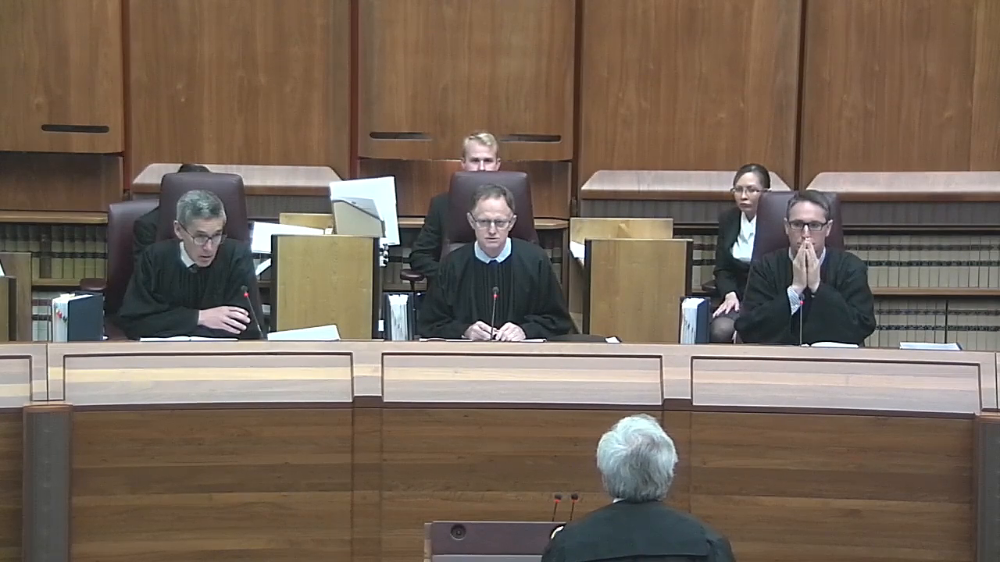
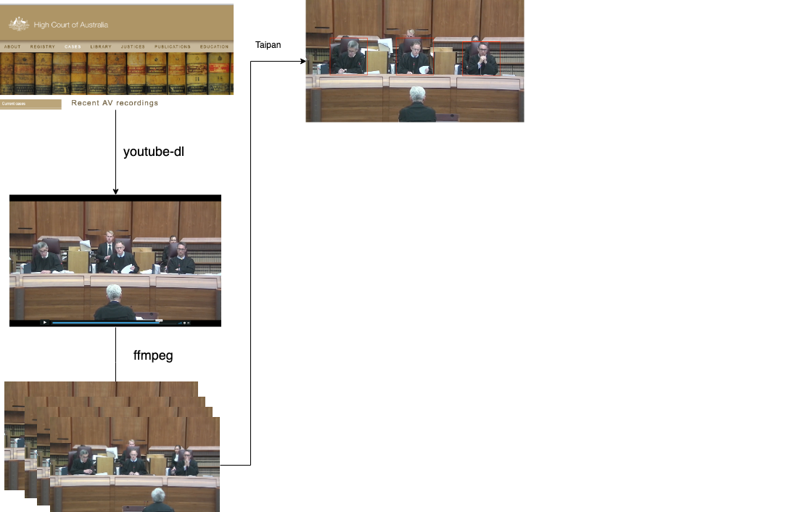
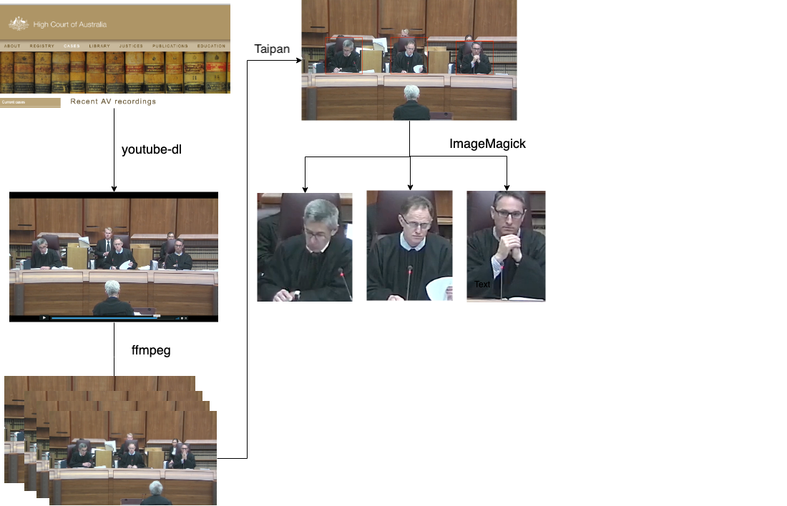
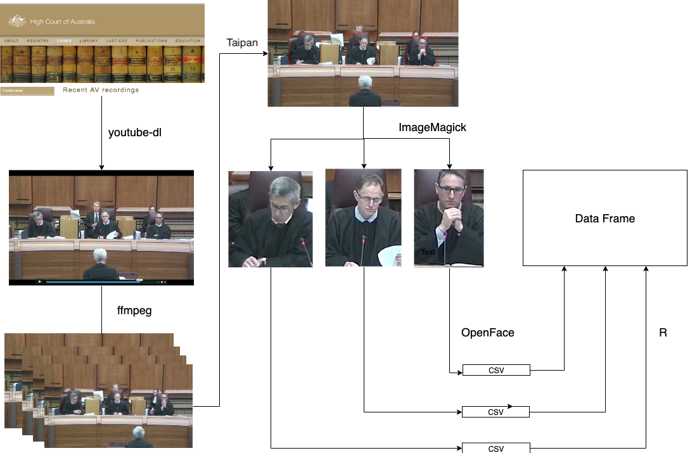
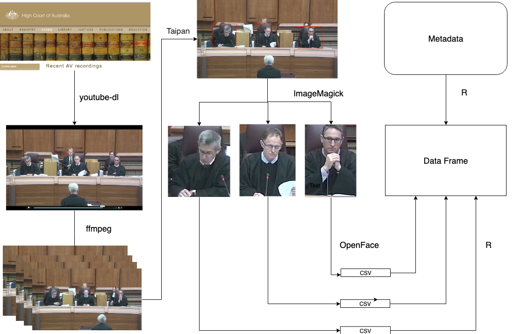
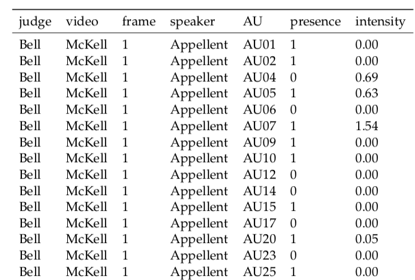

```{r setup, include = FALSE}
knitr::opts_chunk$set(echo = FALSE, 
                      warning = FALSE, 
                      message = FALSE,
                      cache = TRUE, 
                      fig.path = "Figures/", 
                      out.height = "500px", 
                      out.width = "700px", 
                      results = "asis")

library(knitr)
library(ggplot2)
library(emmeans)
library(tidyverse)
library(extrafont)

load("../raw_data/au_tidy.rda")
load("../raw_data/au_meaning.rda")
```

class: title-slide, center, middle

# `r rmarkdown::metadata$title`

### `r rmarkdown::metadata$author` 

### [`r icon::fa_twitter()`](https:://twitter.com/huizezhangsh) huizezhangsh [`r icon::fa_github()`](https:://github.com/huizezhang-sherry) huizezhang-sherry

###`r rmarkdown::metadata$institution`

### https://judgeface.netlify.com/Final_Presentation

---

[](https://www.youtube.com/watch?v=Ae7uKzin0GA)

### Are the justices' facial expressions revealing the outcome of the case?

---
# Previous work

**Judges are expected to be impartial in expressions presented to court.** 

- Chen (2018) 
    - Is Justice really blind? And it is also deaf?
    - **Data collection**: images of lawyers *before* appearing on the Supreme Court, voice audio, augment data on judges and case characteristics 
    - **Finding**: Image and vocal data improved accuracy of predicting case outcome
--

- Tutton, Mack, Roach Anleu (2018)
    - Empirical study of transcripts and AV recordings of judges in High Court cases
    - **Data collection**: Manual tagging of video footage of Australian High Court
    - **Finding**: judges present an impersonal or detached demeanour
--

- Kovalchik and Reid (2018)
    - Use automatic tagging of expressions from facial recognition software to study emotion of tennis players in professional matches, focusing on effect on performance


---
# My research

- Extract facial expression data of the Justices from videos of High Court of Australia

--

- Merge with data from text transcript

--

- Statistically model judges facial expressions

--

- Provide an **objective** source of data to study the problem

--

- Do the results agree or disagree with Tutton's findings, that the justices are appearing impartial?

---
# Face Recognition


- **Paul Ekman**: Facial Action Coding System (FACS)


- it groups movements of facial landmarks into 45 **action units** 


.pull-left[

AU02 -	Outer eyebrow raiser

```{r echo = FALSE, out.height="200px", out.width="350px"}

```
]


.pull-right[

AU15 - Lip corner depressor

```{r echo = FALSE, out.height="200px", out.width="350px"}

```
]

 - widely used in software development and human emotion research

---

class: inverse, center, middle

# Video Processing

---

```{r echo = FALSE, fig.align="center"}

```

---

```{r echo = FALSE, fig.align="center"}

```

---

```{r echo = FALSE, fig.align="center"}

```

---

```{r echo = FALSE, fig.align="center"}

```

---

```{r echo = FALSE, fig.align="center"}

```

---

```{r echo = FALSE, fig.align="center",}

```

--

### 4601 faces and 711 facial variables.

---
class: middle, center 

# Collected data

####**7 videos**

####**6 judges**

####**18 action units**

####68 face landmarks, 56 eye landmarks

####1000 total frames, 4600 faces

---
class: middle, center


```{r echo = FALSE, warning=  FALSE}


```

---
class: inverse, center, middle

#  Method


---

## Notation: 

|Variable|Range|
|---|----|
|Judge| $i = 1,2, \cdots, 6$ |
|Video| $j = 1,2, \cdots, 7$ |
|Action unit|`r length(unique(au_tidy$AU))` possible facial expression|
|Speaker|either the appellant or respondent, $l=1,2$|
|Frame| $t = 1,2, \cdots, T_j$ |
|Presence |The binary $Y$ variable:  $P_{ijkl}$|


<!-- - $X_1$ indicates `judge` with six categories $i = 1,2, \cdots, 6$ -->
<!-- - $X_2$ indicates `video` for each of the seven cases, $j = 1,2, \cdots, 7$ -->
<!-- - $X_3$ indicates action unit containing `r length(unique(au_tidy$AU))` possible facial expression.   -->
<!-- - $X_4$ indicates `speaker`, either the appellant or respondent, $l=1,2$ -->
<!-- - $X_5$ indicates `frame` corresponding to time, $t = 1,2, \cdots, T_j$ -->
<!-- - $P_{ijkl}$ indicates the binary `presence` variable  -->


---

## Modelling:

GLM model with binomial link: 

\begin{aligned}
P_{ijkl} &= \frac{e^{\eta_{ijkl}}}{1 + e^{\eta_{ijkl}}} \\
\eta_{ijkl} &= \mu + \alpha_i + \beta_j +\gamma_k + \delta_l + (\alpha\beta)_{ij} + (\alpha\gamma)_{ik} + (\beta\gamma)_{jk} + (\alpha\delta)_{il} + \varepsilon_{ijkl}
\end{aligned}

<br>
where

- $\mu$ sets an overall mean

- $\alpha_i$, $\beta_j$, $\gamma_k$ and $\delta_l$ represent the effect of different judges, video, action unit and speaker, respectively

- The interaction term between judge ( $\alpha_i$) and video ( $\beta_j$) allows different judges to react differently in different videos. Similarly for judge and action unit, judge and speaker, and action unit and speaker. 

--

 **Do the justices' expression differ from case to case?**
 **Do the justices' expression differ when different parties are speaking?**


---
class: inverse, center, middle

#  Result

---

Model summary, and F test result

---

Explain multiple coomparisons

---

```{r video-plot, echo = FALSE, message = FALSE, warning = FALSE, fig.width=16, fig.height=12, out.width="100%", out.height="100%"}
model_dt <- au_tidy %>% 
  ungroup(judge) %>% 
  mutate(judge = fct_relevel(judge, "Edelman"), 
         AU = fct_relevel(AU, "AU01")) 

model_dt_2 <- model_dt %>% 
  filter(AU %in% c("AU02", "AU14", "AU20","AU15")) 

binomial_model_2 <- glm(presence ~ judge*video + judge*AU + video*AU, 
                        family = binomial(link = "logit"),  
                        data = model_dt_2)

emmean_obj_2 <- emmeans(binomial_model_2, c("judge", "video", "AU"), 
                         type = "response") 

int_2 <- confint(emmean_obj_2, adjust = "bonferroni")

int_2 %>% 
  filter(!is.na(df)) %>% 
  mutate(judge = fct_relevel(judge, c("Edelman", "Keane", "Kiefel", "Nettle", "Gageler", "Bell"))) %>% 
  ggplot(aes(x= fct_relevel(video, c("Nauru-a", "Nauru-b", "Rinehart-a",
                               "Rinehart-b", "McKell", "OKS", "Parkes")), 
                            y = prob,  group = judge)) + 
  geom_point(aes(col= video), size = 2) + 
  geom_line(alpha = 0.5, lty = "dashed") + 
  geom_errorbar(aes(ymin = asymp.LCL, ymax = asymp.UCL, col= video), 
                width = 0.2, size = 2) + 
  facet_grid(AU ~ judge, scales = "free") + 
  theme(legend.position = "bottom", 
        legend.text = element_text(size = 30),
        axis.title = element_text(size=  40),
        axis.text.x = element_text(angle = 90, hjust = 1, size= 25),
        axis.text = element_text(size = 25), 
        strip.text.x = element_text(size = 30),
        strip.text.y = element_text(size = 30)) + 
  xlab("video") + 
  ylab("Proportion")
  
```

---
## Summary of results

- Generally the judges expressions are the same regardless of video

- Nettle always has a raised outer eyebrow (AU02)

- Gageler and Bell reacted strongly to the OKS case, but Edelman and Keane did not


**Our results mostly validate Tutton et al (2018) that the judges appear impartial, with the exception of Gageler and Bell for the OKS case.**

--

**Facial recognition analysis of the videos provides a way to objectively assess judicial behaviour.** 

---

Future work where you talk about intensity modeling

---

# Caveats about my work: 

More frequent interval: 
- current frame extraction is conducted on 1 minute interval
- more frequent time interval i.e. 5 second,  could be used for more precise emtions

More videos
- 7 videos are processed in the facial recognition software
- more videos could be processed if higher resolution videos are accessible

My work has established a workflow for extracting facial expressions of human from videos. All the scripts are available from my github repo: 

#### https:://github.com/huizezhang-sherry/ETC4860 


---

## Packages used in the research: 


- [**youtube-dl**](https://ytdl-org.github.io/youtube-dl/index.html) for video downloading

- [**ffmpeg**](https://www.ffmpeg.org/) for video processing

- [**taipan**](https://github.com/srkobakian/taipan) R package for image annotation

- [**ImageMagick**](https://imagemagick.org/index.php) for image processing

- [**OpenFace**](https://github.com/TadasBaltrusaitis/OpenFace) for facial recognition

- [**tidyverse**](https://CRAN.R-project.org/package=tidyverse) suite of R packages for data manipulation and plotting

- [**emmeans**](https://CRAN.R-project.org/package=emmeans) for producing customised model output 


---
class: center, middle

# Acknowledgements

I would like to express my gratitude to Di Cook and Russell Symth for supervising this work, and Stephanie Kobakian and Stuart Lee for helping me throughout the project.


Slides created via the R package [**xaringan**](https://github.com/yihui/xaringan).

---

## Image processing: Chen (2018)

```{r out.width="500px", fig.align= "center"}
include_graphics(here::here("images", "HOG.png"))
```

