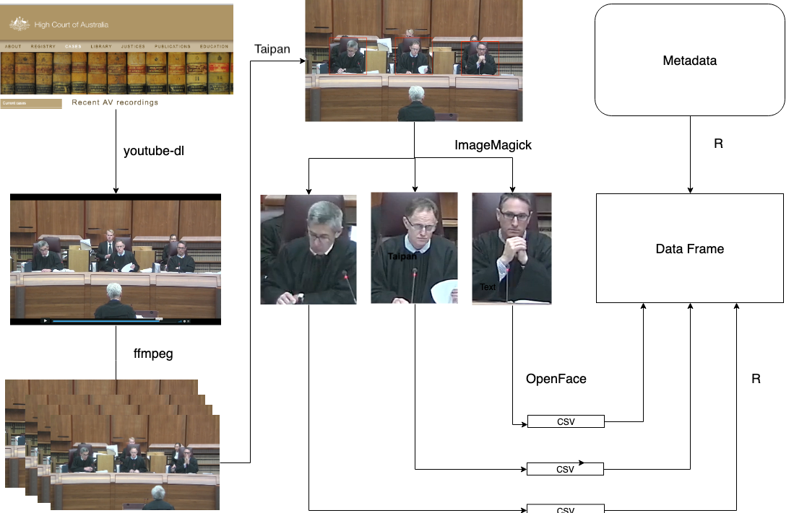
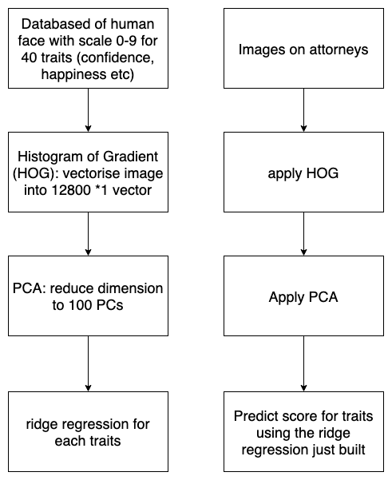

```{r setup, include = FALSE}
knitr::opts_chunk$set(echo = FALSE, 
                      warning = FALSE, 
                      message = FALSE,
                      cache = TRUE, 
                      fig.path = "Figures/", 
                      out.height = "500px", 
                      out.width = "700px", 
                      results = "asis")

library(knitr)
library(emmeans)
library(tidyverse)
library(car)
library(broom)

load("../raw_data/au_tidy.rda")
load("../raw_data/au_meaning.rda")
```

class: title-slide, center, middle

# `r rmarkdown::metadata$title`

### `r rmarkdown::metadata$author` 

<br>

### https://judgeface.netlify.com/Final_Presentation

---
class: center
[](../nauru_a.mp4)

### Are the justices' facial expressions revealing the outcome of the case?

---
# Previous work

**Judges are expected to behave impartial in the courtroom** 

- Chen (2018) 
    - Is Justice really blind? And it is also deaf?
    - **Data collection**: images of attorney *before* appearing on the Supreme Court, vocal information, augment data on judges and case characteristics 
    - **Finding**: Image and vocal data improved accuracy of predicting case outcome

--

- Tutton, Mack, Roach Anleu (2018)
    - Empirical study of transcripts and AV recordings of judges in High Court cases
    - **Data collection**: Manual tagging of video footage of Australian High Court
    - **Finding**: judges present an impersonal or detached demeanour

---
class: middle

- Kovalchik and Reid (2018)
    - Use automatic tagging of expressions from facial recognition software to study the emotion of tennis players in professional matches, focusing on the effect on performance

---
class: inverse, middle
# My research

###  <class: style="color:#f92672">**Provide an objective source of data to study the expression of judges**</span>

###  <class: style="color:#f92672">**Do the results agree or disagree with Tutton's findings, that the justices are appearing impartial?** </span>


---

# Face Recognition


- **Paul Ekman**: Facial Action Coding System (FACS)


- it groups movements of facial muscles into 45 **action units** 


.pull-left[
<center>
AU02 -	Outer eyebrow raiser

```{r AU02, echo = FALSE, out.height="200px", out.width="350px"}
include_graphics("../images/AU2-right-only.gif")
```
]


.pull-right[
<center>
AU15 - Lip corner depressor

```{r AU15, echo = FALSE, out.height="200px", out.width="350px"}
include_graphics("../images/AU15.gif")
```
]


---
class: inverse, middle

# What I've done 

- <span: style="font-size:20pt">Extract facial expression data of the Justices from videos of High Court of Australia </span>


- <span: style="font-size:20pt">Merge with data from text transcripts</span>


- <span: style="font-size:20pt">Statistically model judges facial expressions</span>

---
class: inverse, middle, center

# Data Collection

---
class:middle

```{r workflow_0, echo = FALSE, fig.align="center",fig.width=16, fig.height=9, out.height="90%", out.width="90%"}

```

---
class:middle
```{r workflow_1, echo = FALSE, fig.align="center", fig.width=16, fig.height=9, out.height="90%", out.width="90%"}
include_graphics("../images/workflow_1 (0).png")
```

---
class:middle
```{r workflow_2, echo = FALSE, fig.align="center", fig.width=16, fig.height=9, out.height="90%", out.width="90%"}
include_graphics("../images/workflow_1 (1).png")
```

---
class:middle
```{r workflow_3, echo = FALSE, fig.align="center", fig.width=16, fig.height=9, out.height="90%", out.width="90%"}
include_graphics("../images/workflow_1 (2).png")
```

---
class:middle
```{r workflow_4, echo = FALSE, fig.align="center", fig.width=16, fig.height=9, out.height="90%", out.width="90%"}
include_graphics("../images/workflow_1 (3).png")
```

---
class:middle
```{r workflow_5, echo = FALSE, fig.align="center", fig.width=16, fig.height=9, out.height="90%", out.width="90%"}
include_graphics("../images/workflow_1 (4).png")
```

---
class:middle

```{r workflow_6, echo = FALSE, fig.align="center",fig.width=16, fig.height=9, out.height="90%", out.width="90%"}
include_graphics("../images/workflow_1_new.png")
```

---
class: middle, center 

# Collected data

####**6 judges**

####**7 videos**

####**18 action units**

####68 face landmarks, 56 eye landmarks

####1000 total frames, 4600 faces

---
class: middle, center


```{r data-format, echo = FALSE, warning=  FALSE}
au_tidy %>% filter(judge == "Edelman", video == "McKell") %>% head(15) %>% select(-intensity) %>% kable(format = "html")
```

---
class: inverse, center, middle

#  Method


---

## Notation: 

|Variable|Range|
|---|----|
|Judge| $i = 1,2, \cdots, 6$ |
|Video| $j = 1,2, \cdots, 7$ |
|Action unit| $k = 1, 2, \cdots, `r length(unique(au_tidy$AU))`$ possible facial expressions|
|Speaker| $l = 1,2$: either the appellant or respondents|
|Presence |The binary $Y$ variable:  $P_{ijkl}$|


<!-- - $X_1$ indicates `judge` with six categories $i = 1,2, \cdots, 6$ -->
<!-- - $X_2$ indicates `video` for each of the seven cases, $j = 1,2, \cdots, 7$ -->
<!-- - $X_3$ indicates action unit containing `r length(unique(au_tidy$AU))` possible facial expression.   -->
<!-- - $X_4$ indicates `speaker`, either the appellant or respondent, $l=1,2$ -->
<!-- - $X_5$ indicates `frame` corresponding to time, $t = 1,2, \cdots, T_j$ -->
<!-- - $P_{ijkl}$ indicates the binary `presence` variable  -->

---


## Modelling:

Binomial model with logit link: 

\begin{aligned}
P_{ijkl} &= \frac{e^{\eta_{ijkl}}}{1 + e^{\eta_{ijkl}}} \\
\eta_{ijkl} &= \mu + \alpha_i + \beta_j +\gamma_k + \delta_l + (\alpha\beta)_{ij} + (\alpha\gamma)_{ik} + (\beta\gamma)_{jk} + (\alpha\delta)_{il} + \varepsilon_{ijkl}
\end{aligned}

where

- $\mu$ sets an overall mean

- $\alpha_i$, $\beta_j$, $\gamma_k$ and $\delta_l$ represent the main effect of judges, video, action unit and speaker, respectively

- The interaction term between judge ( $\alpha_i$) and video ( $\beta_j$) allows different judges to react differently in different videos. Similarly for judge and action unit, judge and speaker, and action unit and speaker. 

--

## **Do the justices' expressions differ from case to case?** 


---
class: inverse, center, middle

#  Result

---

.pull-left[
## Model summary
```{r summary-table, echo = FALSE}
model_dt <- au_tidy %>% 
  ungroup(judge) %>% 
  mutate(judge = fct_relevel(judge, "Edelman"), 
         AU = fct_relevel(AU, "AU01")) 

model_dt_2 <- model_dt %>% 
  filter(AU %in% c("AU02", "AU14", "AU20","AU15")) 

binomial_model_2 <- glm(presence ~ judge*video + judge*AU + video*AU, 
                        family = binomial(link = "logit"),  
                        data = model_dt_2)

tidy(binomial_model_2) %>% 
  head(10) %>% 
  kable(format = "html", digits = 4)

```
]

.pull-right[
## ANOVA 
```{r ANOVA, echo = FALSE}
Anova(binomial_model_2, type = "III", singular.ok = TRUE) %>% 
  kable(format = "html", digits = 2) %>% 
  kableExtra::column_spec(4, background = "#FFC0CB")
```


<br>
Traditional estimates (left) are not interpretable: use Estimated Marginal Mean (EMM)

ANOVA doesn't specifically tell us which means are different from each other.

]


---

## Post-model analysis - multiple comparison

.left-column[
The adjustment is made to ensure the confidence level of the whole group is 95%

each judge-AU group

Bonferroni Adjustment

]


.right-column[
```{r echo = FALSE}
emmean_obj_2 <- emmeans(binomial_model_2, c("judge", "video", "AU"), 
                         type = "response") 

int_2 <- confint(emmean_obj_2, adjust = "bonferroni")

int_2 <- confint(emmean_obj_2, by = c("judge", "video"), adjust = "bonferroni") %>% 
  as.data.frame()

int_2 %>% head(15) %>% 
  filter(!is.na(prob)) %>% 
  select(-c(df)) %>% 
  kable(format = "html", digits = 4) 
```
]

---

```{r model-plot, echo = FALSE, message = FALSE, warning = FALSE, fig.width=16, fig.height=9, out.width="100%", out.height="100%"}


model_plot <- int_2 %>% 
  left_join(au_meaning, by = c("AU" = "AU_number")) %>% 
  select(-Muscle) %>% 
  filter(!is.na(df)) %>% 
  mutate(judge = fct_relevel(judge, c("Edelman", "Keane", "Kiefel", 
                                      "Nettle", "Gageler", "Bell"))) %>% 
  ggplot(aes(x= fct_relevel(video, c("Nauru-a", "Nauru-b", "Rinehart-a",
                               "Rinehart-b", "McKell", "OKS", "Parkes")), 
                            y = prob,  group = judge)) + 
  geom_point(aes(col= video), size = 3, width = 0.2) + 
  geom_line(alpha = 0.5, lty = "dashed") + 
  geom_errorbar(aes(ymin = asymp.LCL, ymax = asymp.UCL, col= video), 
                width = 0.2, size = 2) + 
  facet_grid(AU_meaning ~ judge, scales = "free",
             labeller = label_wrap_gen(width = 5)) + 
  theme(legend.position = "none", 
        legend.text = element_text(size = 30),
        axis.title = element_text(size=  40),
        axis.text = element_text(size = 20),
        axis.text.x = element_text(angle = 90, hjust = 1, size= 25),
        strip.text.x = element_text(size = 20),
        strip.text.y = element_text(size = 20, angle = 0)) + 
  xlab("Case") + 
  ylab("Proportion")

model_plot  
```

---
# Discussion

.pull-left[

- Generally the judges expressions are the same regardless of the video

- Gageler and Bell reacted strongly to the OKS case, but Edelman and Keane did not

Validate Tutton et al (2018) that the judges appear impartial, with the exception of Gageler and Bell for the OKS case.

]

.pull-right[

```{r model-plot_2, echo = FALSE, message = FALSE, warning = FALSE, fig.width=16, fig.height=9, out.width="100%", out.height="100%"}

model_plot
  
```
]

---
class: inverse, middle

# Contribution


- ### <span style="color:#f92672">establish a workflow for extracting facial expressions of human from videos. </span>

- ###<span style="color:#f92672">provide a way to *objectively* assess judicial behaviour. </span>

---

# Future work

.pull-left[

- Model intensity score

- More study on multiple comparison

- More frequent time interval: to catch more precise emotions

- More videos to process if higher resolution videos are accessible

]


.pull-right[
```{r intensity, echo = FALSE, fig.height=9, fig.width = 12, out.height="100%", out.width="100%"}
au_intensity_all <- au_tidy %>% 
  mutate(is_intense = ifelse(intensity >= 2, 1, 0))  

model_dt %>% 
  ggplot(aes(x = intensity)) + 
  geom_histogram() + 
  facet_wrap(vars(judge)) + 
  theme(axis.text = element_text(size = 30), 
        strip.text = element_text(size = 30), 
        axis.title = element_text(size = 30))
```

]


---

# Packages used in the research: 


- [**youtube-dl**](https://ytdl-org.github.io/youtube-dl/index.html) for video downloading

- [**ffmpeg**](https://www.ffmpeg.org/) for video processing

- [**taipan**](https://github.com/srkobakian/taipan) R package for image annotation

- [**ImageMagick**](https://imagemagick.org/index.php) for image processing

- [**OpenFace**](https://github.com/TadasBaltrusaitis/OpenFace) for facial recognition

- [**tidyverse**](https://CRAN.R-project.org/package=tidyverse) suite of R packages for data manipulation and plotting

- [**emmeans**](https://CRAN.R-project.org/package=emmeans) R package for computing estimated marginal mean 

- [**car**](http://socserv.socsci.mcmaster.ca/jfox/Books/Companion) R package for ANOVA test. 
---
class: center, middle

# Acknowledgements

I would like to express my gratitude to Di Cook and Russell Symth for supervising this work, and 

Stephanie Kobakian and Stuart Lee for ad-hoc helps. 

All the scripts are available from my github repo:  https://github.com/huizezhang-sherry/ETC4860 


Slides created via the R package [**xaringan**](https://github.com/yihui/xaringan).

---

## Image processing: Chen (2018)

```{r HOG, echo = FALSE, out.width="500px", fig.align= "center"}

```

---

## Most common action units


.left-column[

$$P_{ik} = \frac{\sum_{jt}X_{ijtk}}{\sum_{j = 1}^JT_j}$$

- AU02: outer eyebrow raise
- AU20: lip stretcher
- AU15: Lip Corner Depressor
- AU14: Dimpler

]

.right-column[

```{r echo =FALSE, fig.height=9, fig.width=16}
most_common <- au_tidy %>% 
  group_by(judge,AU) %>% 
  summarise(avg_presence = mean(presence)) %>% 
  filter(avg_presence != "NaN") %>% 
  group_by(judge) %>% 
  arrange(-avg_presence) %>% 
  mutate(common = row_number()) %>% 
  mutate(most_common = as_factor(ifelse(common <=5, 1, 0))) %>% 
  left_join(au_meaning, by = c("AU" = "AU_number")) %>% 
  mutate(AU = as.factor(AU))

most_common %>% 
  ggplot(aes(x =  fct_reorder(AU, avg_presence), y = avg_presence,
             fill = most_common, col = most_common)) + 
  geom_col() +
  xlab("AU") + 
  ylab("Average Presence") + 
  facet_wrap(vars(judge)) + 
  coord_flip() + 
  theme(legend.position = "none", 
        legend.text = element_text(size = 30),
        axis.title = element_text(size=  30),
        axis.text = element_text(size = 20),
        strip.text.x = element_text(size = 20))
```

]

---

## Bonferroni adjustment

- Bonferroni adjustment is a method to deal with multiple comparisons. 

- If multiple hypotheses are tested simultaneously, the <span style="color:#f92672">type I error (False positive rate)</span> increases.

- Therefore, Bonferroni adjustment rejects the null hypothesis at <span style="color:#f92672"> $p=\frac{\alpha}{m}$ </span>, so that the family wise error rate is $\le \alpha$

- In confidence interval, each individual interval will be computed with confidence:<span style="color:#f92672"> $1 - \frac{\alpha}{m}$ </span>
