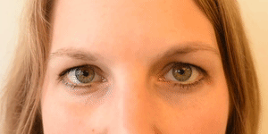

# Results

## Notation

Let $\mathbf{X}$ be a matrix of predictors, and $\mathbf{Y}$ variable in our case is bivariate matrix of response variables, including a binary indicator of presence/absence and a numeric value measuring intensity, of facial action unit, where 

- $X_1$ indicates `judge_id` with six categories $i = 1,2, \cdots, 6$
- $X_2$ indicates `video_id` for each of the seven cases, $j = 1,2, \cdots, 7$
- $X_3$ indicates action unit containing `r length(unique(au_tidy$AU))` possible facial expression.  
- $X_4$ indicates `speaker`, either the appellant or respondent, $l=1,2$
- $X_5$ indicates `frame_id` corresponding to time, $t = 1,2, \cdots, T_j$

Note that $t$ could be considered a time variable, but because images are taken at 1 minute intervals, temporal dependence is unlikely to exist. Rather this should be considered an independent observation. 

A full, main effects model for the data might be expressed as:

$$Y_{ijkl} = \mu + \alpha_i + \beta_j + \gamma_k + \delta_l + \varepsilon_{ijkl}$$ 

\noindent and we would be interested in interactions between judge, case, action unit and who is speaking. An alternative model structure, is to treat each action unit individually, and fit separate models. 

Also, let $P_{jitkl}$ represent the response variable presence, and $I_{jitkl}$ represent the second response variable intensity. This notation will be helpful for defining the plots and models explained in this section.

<!--
CP_2(\alpha_i, \beta_j, \gamma_t, \delta_k) + CP_3(\alpha_i, \beta_j, \gamma_t, \delta_k)$$

where 

- $CP_2$ is the all possible interaction of the two variables
- $CP_3$ is the all possible interaction of the three variables
-->

## Action unit: Presence
 
 
### Mean presence 

The plot gives an overview of the presence of all the action unit across all the judge. The statistic each bar represents is the average presence of an action unit for a judge throughout all the video time and it can be written as $$P_{ik} = \frac{\sum_{jt}X_{ijtk}}{\sum_{j = 1}^JT_j}$$. The order of Action unit on the y axis is ranked by the average presence of all the judge, which can be re-presented as $P_{* K}$. 

```{r}
# Because each judge has different numbers of frame available, mean is a better way ,than sum/ count,  to discribe the frequency of occurence. 

most_common <- au_tidy %>% 
  group_by(judge_id,AU) %>% 
  summarise(avg_presence = mean(presence)) %>% 
  filter(avg_presence != "NaN") %>% 
  group_by(judge_id) %>% 
  arrange(-avg_presence) %>% 
  mutate(common = row_number()) %>% 
  mutate(most_common = as_factor(ifelse(common <=5, 1, 0))) %>% 
  left_join(au_meaning, by = c("AU" = "AU_number")) %>% 
  mutate(AU = as.factor(AU))

most_common %>% 
  ggplot(aes(x =  fct_reorder(AU, avg_presence), y = avg_presence,
         fill = most_common, col = most_common)) + 
  geom_col() +
  xlab("AU") + 
  ylab("Average Presence") + 
  facet_wrap(vars(judge_id)) + 
  coord_flip() + 
  theme(legend.position = "none")
```

The most frequent displayed action unit is highlighed in blue for each judge and summarised in the table below. 

```{r}
# in a table format
knitr::kable(most_common %>% 
  filter(most_common ==1) %>% 
  select(c(judge_id, AU)) %>% 
  mutate(index = row_number()) %>% 
  spread(judge_id, AU))
```

It can be seen that some of the action units are common across almost all the judges, these includes 

- AU02 (outer eyebrow raise), 
- AU20 (lip stretcher), 
- AU15 (Lip Corner Depressor) and 
- AU14 (Dimpler)

The table below summarises the judge specific high frequent action units.

```{r}
other_highf <- most_common %>% 
  filter(most_common ==1) %>% 
  select(-c(common, most_common, avg_presence, Muscle)) %>% 
  filter(!AU %in% c("AU02", "AU20", "AU15", "AU14")) %>% 
  mutate(index = row_number()) %>% 
  select(-AU) %>% 
  spread(index, AU_meaning) %>% 
  rename(first = `1`, second = `2`, third = `3`) %>% 
  mutate_all(funs(replace_na(., 0)))

knitr::kable(other_highf)
```

These are the results from inspecting the action units visually and they should also be reflected thorugh the coefficients of the relevant models [see stage 3 modelling]. 


### Model fit

The first model I use is a generalised linear model with binomial link to understand the presence of the action units. The variables used include the judge_id and a selection of action units based on the mean presence result in the previous section. The action units are chosen to be the ones with at least two judges have them to be the most common five action units. The model can be written down as 

$$P_{ik} = \mu + \alpha_i + \delta_k + (\alpha\delta)_{ik}$$

```{r}
most_common_au <- most_common %>% 
  ungroup(judge_id) %>% 
  group_by(AU) %>% 
  summarise(mean = mean(avg_presence)) %>% 
  arrange(-mean) %>% 
  top_n(7)

au_model <- au_tidy %>% 
  ungroup(judge_id) %>% 
  filter(AU %in% most_common_au$AU) %>% 
  mutate(judge_id = fct_relevel(judge_id, "Edelman"), 
         AU = fct_relevel(AU, "AU25"))

binomial_model <- glm(presence ~ (.-frame_id-speaker-intensity-video_id)^2, 
           family = binomial(link = "logit"),  data = au_model) %>% 
  step(trace = FALSE)

glance(binomial_model) %>% kable()
tidy(binomial_model)[1:13,] %>% kable(digits=2)
tidy(binomial_model)[13:nrow(tidy(binomial_model)),] %>% kable(digits=2)

au_model_1_aug <- augment(binomial_model, au_model)
#ggplot(au_model_1_aug, aes(x=.fitted, y=.resid)) + geom_point()

#summary(binomial_model)
```

### Presence by videos

Apart from visualising the general presence score for all the action unit, we are also interested in the break down statistics by video.  The statistics being plotted is thus $$P_{ijk} = \frac{\sum_{t}X_{ijtk}}{T_j}$$ with selected most common four action units. From this plot, it is interesting to know that almost all the judges have more frequent action units on the face for case OKS. This maybe related to the nature of the case... 

```{r}
most_common_subset <- most_common %>% 
  filter(most_common == 1) %>% 
  mutate(index = paste0(judge_id,AU))
  
more_presence <- au_tidy %>% 
  group_by(judge_id,AU, video_id) %>% 
  summarise(avg_presence = mean(presence)) %>% 
  filter(avg_presence != "NaN") %>% 
  arrange(-avg_presence) %>% 
  mutate(index = paste0(judge_id,AU)) %>% 
  filter(index %in% most_common_subset$index) %>% 
  ungroup(judge_id) %>% 
  left_join(au_meaning, by = c("AU" = "AU_number")) %>% 
  mutate(AU = as.factor(AU))
  
more_presence %>% 
  filter(AU %in% c("AU02", "AU14", "AU15", "AU20")) %>% 
  ggplot(aes(x = video_id, y = avg_presence, 
             group = judge_id, col = judge_id)) + 
  geom_line() + 
  geom_point() + 
  facet_wrap(vars(AU_meaning),scales = "free_x") + 
  theme(axis.text.x = element_text(angle = 30, hjust = 1))

```

### Model fit

$$P_{ijk} = \mu + \alpha_i + \beta_j +\delta_k + (\alpha\beta)_{ij}+(\alpha\delta)_{ik} + (\beta\delta)_{jk}$$

```{r}

binomial_model_2 <- glm(presence ~ (.-frame_id-speaker-intensity)^2, 
           family = binomial(link = "logit"),  data = au_model) %>% 
  step(trace = FALSE)

glance(binomial_model_2) %>% kable()

tidy(binomial_model_2)[1:19,] %>% kable(digits=2)
tidy(binomial_model_2)[19:nrow(tidy(binomial_model_2)),] %>% kable(digits=2)

#au_model_2_aug <- augment(binomial_model_2, au_model)

# binomial_model_2 <- glm(presence ~ judge_id + AU + video_id +
#         judge_id*AU + AU*video_id + judge_id*video_id, 
#            family = "binomial",  data = au_model) %>% 
#   step(trace = FALSE)
# 
# summary(binomial_model_2)
# tidy(binomial_model_2)
# glance(binomial_model_2)

```

```{r eval=FALSE}
ggplot(au_model_2_aug, aes(x=.fitted, y=.resid)) + geom_point()
```

### Appellant vs. Respondent 

```{r}
binomial_model_3 <- glm(presence ~ judge_id + AU + video_id + speaker + 
        judge_id*AU + AU*video_id + judge_id*video_id + AU*video_id*speaker , 
           family = "binomial",  data = au_model)

glance(binomial_model_3) %>% kable()
tidy(binomial_model_3) %>% kable(digits=2)
```

## Action unit: Intensity

### General Intensity  plot

In Ekman's 20002 FACS manual, the intensity of an action unit is defined based on five classes: Trace: 0-1, Slight: 1-2, Marked or pronounced: 2-3, Severe or extreme: 3-4 and Maximum: 4-5. 

The boxplot of the intensity for all the judges across all the videos is presented in Figure \ref{fig:intensity}. Each bar-and-whisker represents the intensity ($I_{ijtk}$) of all the action units aggregated on time for a particular judge $i$ in a specific case $j$. For example, the first bar-and-whisker in case Nauru_a is created using all the 17 action units of Edelman through out the elapsed time in Nauru_a case.

From the plot, we can see that most of the action units have low intensity score and this is expected because usually judges are expected to behave neutral in the court room. Thus a square root transformation is taken on the y axis for better visualisation effect. We can find that Judge Nettle seems to have higher average in all the four cases he appears: Nauru_a&b, Rinehart_a &b. 

```{r fig.cap="General intensity score by judge and video\\label{fig:intensity}"}
au_intensity_all <- au_tidy %>% 
  mutate(is_intense = ifelse(intensity >= 2, 1, 0))  

# intensity plot
#au_intensity_all %>% 
#  ggplot(aes(x = judge_id, y = intensity, color = judge_id)) + 
#  geom_boxplot() + 
#  facet_wrap(vars(video_id), scales = "free_x") + 
#  theme(axis.text.x = element_text(angle = 30, hjust = 1), 
#        legend.position = "none")

# the plot magnify the box
au_intensity_all %>% 
  ggplot(aes(x = judge_id, y = intensity, color = judge_id)) + 
  geom_boxplot(coef = 100) + 
  facet_wrap(vars(video_id), scales = "free_x") + 
  theme(axis.text.x = element_text(angle = 30, hjust = 1), 
        legend.position = "none") + 
  scale_y_sqrt()

``` 
 
### Mean intensity 

Mean intensity score ($I_{ik}$) of each action unit for each of the judge is computed as $$I_{ik} = \frac{\sum_{jt}X_{ijtk}}{\sum_{j = 1}^JT_j}$$ and ploted in Figure \ref{fig:mean_intensity}. The five most intense action units for each judge are presented in Table \ref{tab:most_intense}. We can find that the common high intense action units includes 

```{r}
# include_graphics("figures/AU20-lip-stretcher.gif", dpi = 128)
# 
# include_graphics("figures/AU4-brow-lowerer.gif")
```

- AU20 (Lip Stretcher)
- AU07 (Lid Tightener)
- AU04 (Brow Lowerer)

It is interesting to notice that both AU07 and AU04 contribute to the emotion of confusion. This could help to understand that judges are more likely to express a stronger confusing expression than other emotions. 


```{r fig.cap="Mean intensity score for each judge and action unit aggregating on videos.\\label{fig:mean_intensity}"}
most_intense <- au_intensity_all %>% 
  filter(!AU == "AU28") %>%  # AU28 doesnt have intensity score
  group_by(judge_id, AU) %>% 
  summarise(mean_intensity = mean(intensity, na.rm = TRUE)) %>% 
  arrange(-mean_intensity) %>% 
  mutate(index = row_number(), 
         most_intense = as.factor(ifelse(index <= 5, 1,0))) 

most_intense%>% 
  ggplot(aes(x = fct_reorder(AU, mean_intensity), 
             y = mean_intensity, 
             fill = most_intense)) + 
  geom_col() + 
  facet_wrap(vars(judge_id)) + 
  coord_flip()
```  
 


```{r}
knitr::kable(most_intense %>% 
  filter(most_intense ==1) %>% 
  select(c(judge_id, AU)) %>% 
  mutate(index = row_number()) %>% 
  spread(judge_id, AU), caption = "\\label{tab:most_intense}The five most intense actio unit for each judge.")
```
 
 
### Intensity plot for the most frequent action units
 
Apart from visualising the general intensity score for all the action units, I'm also interested in the intensity score of the most frequent action units. Figure \ref{fig:intensity_by_au} presents this. The statistics being plotted is $I_{ijtk}$ with $k$ including AU02, AU14, AU15 and AU20 as the most common four action units. From this plot, we can learn that AU02, although being commonly detected for all the judges, has low intensity score. 


```{r fig.cap = "Intensity score of the most frequent action units, seperating by judge and video ID.\\label{fig:intensity_by_au}"}

# plot for four major high frequent action units
au_intensity_all %>% 
  left_join(au_meaning, by = c("AU" = "AU_number")) %>% 
  mutate(AU = as.factor(AU)) %>% 
  filter(AU %in% c("AU02", "AU14", "AU15", "AU20")) %>% 
  ggplot(aes(x = video_id, y = intensity, col = video_id)) + 
  geom_boxplot() + 
  facet_grid(rows = vars(AU_meaning),
             cols = vars(judge_id), scales = "free_x") + 
  theme(legend.position = "none",
        axis.text.x = element_text(angle = 30, hjust = 1))

# plot for other high frequent action units
# intensity_subset_plot <- function(judge){
#   intensity_subset %>% 
#     filter(!AU %in% c("AU02", "AU14", "AU15", "AU20")) %>% 
#     filter(judge_id == judge) %>% 
#     ggplot(aes(x = video_id, y = intensity, col = video_id)) + 
#     geom_boxplot() + 
#     facet_grid(rows = vars(judge_id),
#                cols = vars(AU), scales = "free_x") + 
#     ylim(c(0,4)) + 
#     theme(legend.position = "none",
#           axis.text.x = element_text(angle = 30, hjust = 1))
# }
# 
#   
# judge <- unique(intensity_subset$judge_id)
# subplot <- map(judge, intensity_subset_plot)  
# 
# 
# ggarrange(subplot[[1]], 
#           subplot[[2]],
#           subplot[[5]],
#           subplot[[6]],
#           subplot[[3]],
#           subplot[[4]],
#           ncol = 2, nrow = 3)

```
 
### High intensity points

We filter out the points have intensity greater than 2  (at least "slight" as per Ekman) in the previous plot and plot it against time and color by the speaker. It tells us that Edelman, Gageler and Nettle are the judges have stronger emotion that can be detected (since they have more points with intensity greater than 2). Different judges also have different time where they display stronger emotions. For example, Justice Nettle are more likely to have stronger emotion throughout the time when the appellant is speaking but only at the beginning and ending period when the respondent is speaking.

```{r}
au_intensity_all %>% filter(is_intense ==1) %>% 
  ggplot(aes(x = frame_id, y = intensity, col = speaker)) + 
  geom_point() +
  facet_wrap(vars(judge_id))
```

