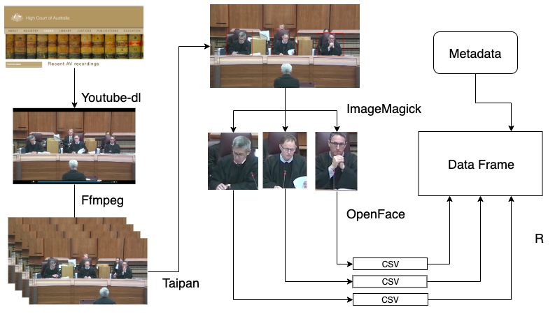
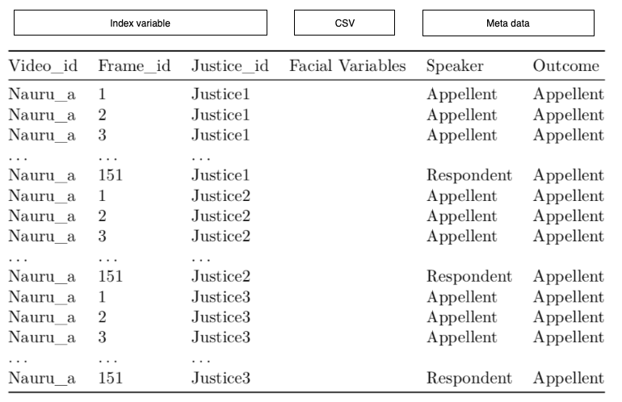

### Can we predict the outcome of an appeal based on facial expressions on the Justices?

[](https://www.youtube.com/watch?v=Ae7uKzin0GA)


---
class: inverse, center, middle

# Background

---
# Recent legal studies on judicial behaviour

Judges are expected to be neutral in the courtroom, but they can be unaware they are making facial expressions. 

- Chan (2018): 
  
 - from video and audio recordings on the United States Supreme Court
 
 - used general image processing methods, but not face recognition

- Tutton et al. (2018): 

  - from transcript and audiovisual recordings on Australian High Court
  
  - manually recorded Judicial expressions from videos and the corresponding transcript.

---
# Face Recognition

- **Paul Ekman** analysed facial actions and expressions, leading to the Facial Action Coding System (FACS)


- Decomposition of facial muscles


.pull-left[

Example: AU_2

```{r echo = FALSE, message = FALSE, warning = FALSE}
library(knitr)
library(ggplot2)
include_graphics("images/AU2-right-only.gif")
```
]


.pull-right[

Example: AU_15

```{r echo = FALSE}
include_graphics("images/AU15.gif")
```
]

- Kovalchik & Reid (2018) utilise OpenFace to study the emotion of professional tennis players in the Australian Open grand slam matches (OUR MOTIVATION)

---

class: inverse, center, middle

# Data Collection

---

## Video Processing (I have done this)



### 4601 faces and 711 facial variables!
---
class: middle, center

### Collected Data

```{r echo = FALSE, warning=  FALSE}


```

---
class: inverse, center, middle

# Preliminary results

---

.pull-left[
confidence = 0.925

```{r echo = FALSE, warning=  FALSE, out.height=250}


```

confidence = 0.775

```{r echo = FALSE, warning=  FALSE, out.height=250}

```
]

.pull-right[
confidence = 0.425

```{r echo = FALSE, warning=  FALSE, out.height=250}

```

confidence = 0.025

```{r echo = FALSE, warning=FALSE, out.height=250}

```
]

---

## Confidence of facial detection - one video

```{r echo = FALSE, warning = FALSE, fig.height=6, fig.width=12}
load("data/nauru_a.rda")
ggplot(nauru_a, aes(x= confidence, col = judge_id, fill = judge_id)) +
  geom_histogram(binwidth = 0.1) + 
  facet_wrap(~judge_id)
```

Low confidence could also be informative, indicating justice gaze is elsewhere

---
class: inverse, center, middle

# Facial landmarking


---

```{r echo = FALSE, warning = FALSE, message = FALSE}
library(tidyverse)
face <- nauru_a %>% select(judge_id, frame_id, starts_with("x_"), starts_with("y_"))
face2 <- face %>% gather(metrics, value, -c(judge_id, frame_id)) %>% 
  separate(metrics, c("cord", "label")) %>% 
  spread(key = cord, value = value) %>%
  mutate(y = -y) %>% 
  filter(frame_id == 4)
```


```{r AU_Gageler, echo = FALSE, warning = FALSE, message = FALSE, fig.align="center",fig.height = 5.5, fig.width = 5.5}
ggplot(subset(face2, judge_id == "Gageler"), aes(x= x, y = y)) +
  geom_point()

```


--

```{r echo = FALSE, warning = FALSE, message = FALSE, fig.align = "center", fig.height = 5, fig.width = 7}
include_graphics("images/nauru-a_004.png")
```


---

```{r AU_Nettle, echo = FALSE, warning = FALSE, message = FALSE, fig.align = "center", fig.height = 5.5, fig.width = 5.5}
ggplot(subset(face2, judge_id == "Nettle"), aes(x= x, y = y)) +
  geom_point() 
```

```{r echo = FALSE, warning = FALSE, message = FALSE, fig.align = "center", fig.height = 5, fig.width = 7}
include_graphics("images/nauru-a_004.png")
```


---

## Transcript data 

```{r echo = FALSE, fig.align ="center"}

```

---

## Justices speaking percentage

```{r chief_j, echo = FALSE, fig.align ="center", fig.width=10, fig.height=6}
load("data/people_frequency.rda")
# dark2 to change the color
# get insights from people's frequency
ggplot(subset(people_frequency, role %in% c("Chief Justice","Justice")), 
       aes(x = people, y = percent, fill = role)) +
  geom_bar(stat = "identity") + 
  facet_wrap(~case, nrow = 1) + 
  coord_flip() + 
  scale_fill_brewer(palette = "Dark2") + 
  xlab("People") + ylab("Percent") 

```

--

Chief Justices tend to interrupt the counsel more than other Justices

---

## The counsel speaking time

Less speaking time (from more interruptions by the judges) is related to higher odds of winning the case (Johnson et al., 2009). 

```{r r_a, echo = FALSE,  fig.align ="center", out.width="100%", fig.width=10, fig.height=5}
temp <- people_frequency %>% 
  filter(role %in% c("Respondent", "Appellant")) %>% 
  ungroup(case) %>% 
  mutate(case = factor(case, levels = c("McKell", "Nauru_b","OKS", "Nauru_a", "Parkes", "Rinehart")))

ggplot(temp) +
  geom_bar(aes(x = role, y = count), alpha = 0.5,  stat = "identity") + 
  geom_text(data = temp %>% filter(outcome == "win"), aes(x = role, y = 0, label = outcome), vjust = -1, color = "red", size=6) +
  scale_fill_brewer(palette = "Dark2") + 
  facet_wrap(~case, nrow = 1, scales = "free_y") + 
  xlab("") + ylab("Count")
```

--

Our data is consistent with this.

---
# Plan 

Completed:

- Data: 6 observations (cases), 700 variables (facial characteristics and meta information),  7 groups (judges)

- Exploratory analysis of one video's data.

To do: 

- Variable reduction: Examine Justices facial expressions 

  - across the appeal, to determine normal characteristics for each judge.
  
  - when respondent or appellant speaks

- Face detection when more judges present generates missings, related to image resolution: Need to determine a solution to impute 

- Model associations between outcomes and much reduced variable set, to find potential indicators of outcome by individual judges expressions.

---

class: center, middle

# Acknowledgement

I would like to express my gratitude to Di Cook, Russell Symth and Staphanie Kobakian for helping me throughout the project.

Slides created via the R package [**xaringan**](https://github.com/yihui/xaringan).


