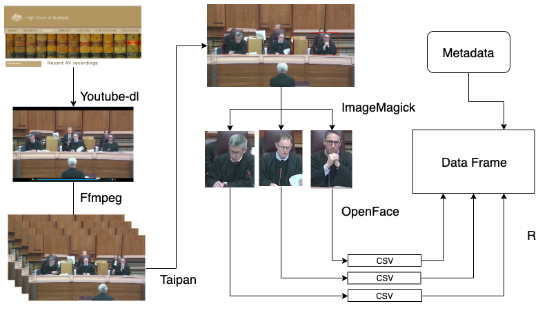
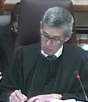
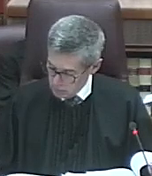
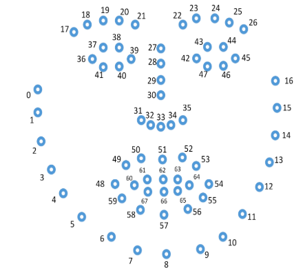
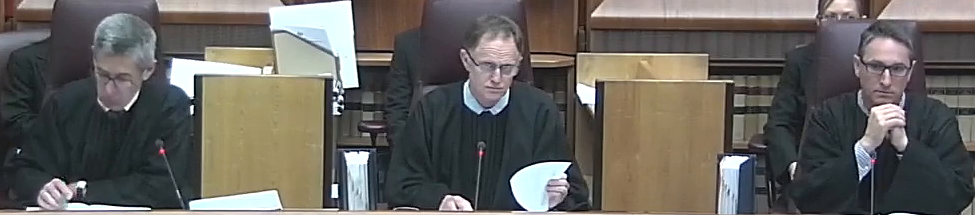

```{r setup, include=FALSE}
knitr::opts_chunk$set(echo = TRUE, cache = TRUE, warning = FALSE)
library(purrr)
library(tidyverse)
library(knitr)


load("data/court.rda")
load("data/nauru_a.rda")
load("data/people_frequency.rda")
```

\newpage


# Statement of the topic

Decisions by courtroom Justices have been discussed broadly in the legal literature. Gender, political views and religious background of both the Justices and counsel in the case potentially influence the decisions. This paper will explore the facial behaviour of the Justices during hearings with the objective of being to assess whether it can help to predict outcomes. Audio Visual(AV) recordings and case transcripts will be computationally processed and analysed to examine the decisions of each Justice. 

# Motivation

@tutton2018judicial attemped to utilize the AV technology, which is made available online by the High Court of Australia [@highcourtau]. They visually inspect of the videos to highlight when Justices depart from the expected norms of judicial conduct. To better understand the emotion status and therefore the departure of the emotional behaviour, more advanced technologies could be applied. An example is to use OpenFace [-@baltrusaitis2018openface] technology, which provides information on emotions exhibited by the Justices. This technique has been applied by @kovalchik2018going on professional tennis players during Grand Slam matches. That study demonstrated the potential to predict the outcome of High Court appeals based on Justices' demeanour utilising contemporary tools and emotion tagging techniques. 
 


# Literature review

The literature sumary is divided into two parts: (1) current work in legal studies to understand the behaviour of the Justices and (2) existing facial recognition and emotion tagging technology.  

## Legal study from a behaviour perspective 

People have attempted to predict the decisions of the Justices for centuries. @judicalguid present the following code of conduct:

>It is important for judges to maintain a standard of behaviour in court that is consistent with the status of judicial office and does not diminish the confidence of litigants in particular, and the public in general, in the ability, the integrity, the impartiality and the independence of the judge. 

This impartiality should be clear in judicial demeanour [@tutton2018judicial; @goffman1956nature]. Paul Ekman [@ekman1991invited] suggests that from a behavioural perspective, some facial and vocal inflections are often unbeknown to the speakers themselves . Many scholars have exploited this in studying the court outcomes through the language and words used by the Justices in the court [@Shullman2004illusion] and vocal and facial characteristics of the Justices [@chen2018justice]. 

There are also existing works to understand the emotion of the Justices from a linguistic perspective and suggest some factors that could be useful to indicate how the Justices' vote and thus the court outcome. These factors include the use of pleasant and unpleasant language by @black2011emotions, the frequency and content of Justices' questions by @Shullman2004illusion and @johnson2009inquiring. @epstein2010inferring use a regression analysis with the number of questions asked by the Justices used to infer the winning party in a case. 

Other scholars [@chen2016perceived; @chen2017covering; @schubert1992observing] have studied the emotion of the Justices from vocal characteristics and suggest that these vocal characteristics, especially perceived masculinity is strongly correlated with the court outcomes. @dietrich2019emotional uses a multilevel logistic model with random effects to suggest that subconscious vocal inflections contain information that is not available from text. 

Chen [-@chen2018justice] employed both vocal and facial characteristics to predict the court votes using Supreme Court data from 1946-2014. The audio clips are first preprocessed to get the Mel-frequency  Cepstral  Coefficients (MFCC) and then applied to a random forest model. The image features are extracted using a Histogram of Oriented Gradients (HOG) method. More specific facial recognition software is readily available to extract human facial features and these facial recognition technologies have not yet been applied to the legal proceedings. 

Most of the literature is conducted using the U.S. Supreme Court Database and less studies have been conducted using Australian High Court data. @tutton2018judicial have used an ethnographic approach to study the transcript and AV recordings in the High Court of Australia but the study is conducted in an observational manner via matching the Justices' distinct behaviour with the transcript.

## Facial recognition

An anatomical analysis of facial action [@ekman1976measuring] led to the Facial Action Code (FAC) [@ekman1978] and has been further revised by @ekman2002facial. This decomposition of facial muscles is widely used in scientific research. It was applied in competitive sports, specifically tennis by @kovalchik2018going who found that the emotion of professional tennis players will have an impact on their performance.

There have been many algorithms created for facial detection and the analysis of their performance when applied to images have been the focus of events like the Audio/Visual Emotion Challenge [@schuller2012avec; @schuller2011avec] and Emotion Recognition In The Wild Challenge and Workshop [@dhall2013emotion; @kahou2013combining]. 

Facial recognition software has also been implemented by DeepFace [@taigman2014deepface] from Facebook, and FaceNet [@schroff2015facenet] from Google. OpenFace [@baltrusaitis2018openface] is the first open-sourced face recognition software that provides facial expression detection, including facial landmarking, head pose estimation, eye gaze tracking and facial action unit detection. Along with its previous version (@baltruvsaitis2016openface), the OpenFace toolkit has been used in different social research studies including depression classification (@yang2016decision and @nasir2016multimodal).  

# Aim 
The aim of this study is to use facial recognition technology to detect judicial thinking and thus their decisions. There are four specific objectives: 

- Read in video streams and convert into a numerical data format.
- Perform data quality checks to investigate video and data quality.
- Exploratory data analysis of the facial expression, trascript variables and outcomes. 
- Explore models to predict the appeal outcomes based on facial expression and text analysis. 

# Research Plan 

The following table details the work has been done so far in the project. 


|Timeline|Tasks|
|--|------------|
|Week 1-2|Explore facial recognition APIs and background reading|
|Week 3| Obtain videos (`Youtube-dl`), crop into video frames (`ffmpeg`) and extract faces from video frames (`ImageMagick`)|
|Week 4| Obtain facial variables via `OpenFace` for one video: Nauru-a|
|Week 5| Preliminary exploratory data analysis on Nauru-a dataset|
|Week 6| Obtain the full dataset and perform data quality checks| 
|Week 7| Text analysis on the case transcripts, augment the dataset with appellant and respondent information|
|Week 8-9| Proposal writing and presentation preparation|

Table:Reserach Plan for semester 1

Future work planned for the project is listed below.  

|Timeline|Tasks|
|--|------------|
|May|Exploratory data analysis on the full dataset and augment data to impute missing values |
|June - August|Summarise Justices' behaviour in the courtroom: |
||    - Are the Justices facial expressions similar and across the trial?|
||   - Do the Justices behave differently when respondent or appellant speaks?|
|September| Modelling the decision of the Justices based on video and transcript data|
|October|Thesis writing and presentation preparation|

Table:Future Reserach Plan 

# Results

## Data processing 

The source data for this research project is the AV recordings publicly available from the High Court of Australia [@highcourtau]. Multiple procedures need to be performed to obtain the dataset.

The workflow for extracting numerical data from the videos can be found in Figure \ref{fig:workflow} in the Appendix. Youtube-dl [@youtube-dl] has been used to download videos from the High Court of Australia[@highcourtau] and the list of videos used in this research project is documented in the Appendix. Image frames are extracted from the videos for every minute via ffmpeg [@ffmpeg], resulting in 1021 image frames (252 frames from `Nauru` videos and 769 frames from other five videos). Taipan [@Taipan] is then used to find the x-y coordinates of the location of the Justices in each image frame. ImageMagick [@ImageMagick] is then used to crop the face of each Justice from each image frame that is taken from each video where three Justices present in `Nauru` videos and five Justices in other videos. The resulting 4601 cropped images (252 image frames from `Nauru` videos where three Justices are presented and 769 image frames from other videos where five justices are presented) are then sent to OpenFace [@baltrusaitis2018openface] to produce the variables for facial landmarking, head pose, eye gaze and facial action unit. This step is performed via the docker platform. 

The resulting outputs from OpenFace are individual comma-separated values (csv) files for each of the 4601 faces considered and processing is done in R to combine all the separate csv files into a final dataframe with appropriate index of `frame_id`, `judge_id` and `video_id`. There are 711 variables in the csv files produced by OpenFace for each face supplied and these variables can be classified into the following categories: 

- Confidence
- Gaze variables
- Eye landmarking (`eye_lmk`) variables
- Pose variables 
- Face landmarking (`face_lmk`) variables
- Action Unit variables 


A sketch of the dataset is provided in the following table.

|Video_id|Frame_id|Justice_id|Facial Variables|Speaker|Outcome|
|----|----|----|-----|---|---|
|Nauru_a|1|Justice1||Appellent|Appellent
|Nauru_a|2|Justice1||Appellent|Appellent
|Nauru_a|3|Justice1||Appellent|Appellent
|...|...|...|||
|Nauru_a|151|Justice1||Respondent|Appellent
|Nauru_a|1|Justice2||Appellent|Appellent
|Nauru_a|2|Justice2||Appellent|Appellent
|Nauru_a|3|Justice2||Appellent|Appellent
|...|...|...|||
|Nauru_a|151|Justice2||Respondent|Appellent
|Nauru_a|1|Justice3||Appellent|Appellent
|Nauru_a|2|Justice3||Appellent|Appellent
|Nauru_a|3|Justice3||Appellent|Appellent
|...|...|...|||
|Nauru_a|151|Justice3||Respondent|Appellent


Table: Data Format

## Data quality 

Data Quality check is performed after obtaining the full dataset. The missing rate for each Justice in each video is summarised in the Table \ref{tab:missing} in the Appendix. For some Justices in some videos, the missing rate could be due to the resolution of the source video and special care will be taken in the data exploration and modelling. 

## Exploratory data analysis for one video

Exploratory data analysis has been done for `Nauru-a` video to understand different kinds of variables provided by OpenFace. 

### Confidence
The confidence variable shows how OpenFace is confident about the detection of the face. From Figure \ref{fig:confidence}, a majority of the faces are detected with a confidence rate higher than 0.7, which shows the effectiveness of the OpenFace software. Several confidence levels from 0 to 1 are selected with the cropped face images displayed in Figure \ref{fig:confidence0.925},\ref{fig:confidence0.775},\ref{fig:confidence0.425},\ref{fig:confidence0.025} in the Appendix for readers to have a better understanding. From these figures, the score of the confidence level is more related to the angle that the Justice's face present in the images. A lower confidence score is still useful information indicating that there's a higher probability that the Justices is looking at the paperwork at that moment.

### Gaze and pose 
Gaze and pose variables provide very similar information on the direction the eyes are looking and the direction of the head in these courtroom images. In Figure \ref{fig:gaze}, both Justice Edelman and Justices Gageler are looking straight for most of the time while Justices Nettle tends to look towards right hand side. This could due to the fact that Justice Nettle usually sits on the left hand side of the courtroom according to the etiquette in the court.

### Face landmarking
Face Landmarking locates the key points include eyebrows, eye, nose, lip and chin on the face and a standard facial landmarking guide is shown in Figure \ref{fig:standard-landmarking} in the Appendix. The computed facial landmarking by OpenFace is also plotted in Figure \ref{fig:AU_Gageler} and \ref{fig:AU_Nettle} in the Appendix with Figure \ref{fig:origin_image} being the origin image frame from the video. Notice that OpenFace indeed captures the shape of Justice Nettle on the left most of the image. 

### Action unit

Facial Action Unit(AU), as a way to describe human facial expression, has been discussed in the literature review section. OpenFace produces 17 Action Units and Figure \ref{fig:AU} in the Appendix shows the average AU detected for every Justices in the `Nauru-a` video. The most freqentist detected AU are `AU2`, `AU17` and `AU20`, which stands for outer eye brow raising, chin raising and lip stretcher. 


## Text analysis 
Interruptions have been studied by interactional sociolinguistics [@friedrich1972social; @kennedy1983interruptions; @konakahara2015analysis]. Smith-Lovin and Brody[-@smith1989interruptions] argues that if a person wants to move a discussion toward issues he  or she  prefers to discuss, interrupting another participant is often an effective strategy. Similarly, in the courtroom, interrupted by the judges has a negative implication on the odd of winning the case [@johnson2009inquiring]. Transcripts for each case are used to compute the number of time appellant, respondent and each of the Justices speak and visualisation is created in Figure \ref{fig:r_a} and \ref{fig:chief_j} in the appendix. A higher number of time the appellant speak means the appellant is interrupted more often by the Justices. 

From Figure \ref{fig:chief_j}, the Chief Justice will interrupt the barristers more often than other Justices. In Figure \ref{fig:r_a}, it seems that for the four cases that have been decided up until now, three out of four cases have the party being interrupted less win the cases, which coincides with the current literature mentioned above.


\newpage

# Appendix

|Case|Name|AV recording link|
|------|--|-----|
|Republic of Nauru v. WET040| `Nauru_a`|http://www.hcourt.gov.au/cases/cases-av/av-2018-11-07a|
|TTY167 v. Republic of Nauru|`Nauru_b`|http://www.hcourt.gov.au/cases/cases-av/av-2018-11-07b|
|Rinehart & Anor v. Hancock Prospecting Pty Ltd & Ors on 13 Nov 18 |`Rinehart_a`|http://www.hcourt.gov.au/cases/cases-av/av-2018-11-13|
|Rinehart & Anor v. Hancock Prospecting Pty Ltd & Ors on 14 Nov 18 |`Rinehart_b`|http://www.hcourt.gov.au/cases/cases-av/av-2018-11-14a|
|Parkes Shire Council v. South West Helicopters Pty Limited |`Parkes`|http://www.hcourt.gov.au/cases/cases-av/av-2018-11-14b|
|McKell v. The Queen| `McKell`|http://www.hcourt.gov.au/cases/cases-av/av-2018-12-07|
|OKS v. The State of Western Australia|`OKS`|http://www.hcourt.gov.au/cases/cases-av/av-2019-02-14|

Table: Details of videos processed.

{#fig:workflow}


```{r missing-rate, echo = FALSE}
court_miss <- court %>% 
  select(judge_id, frame_id, video_id, x_1) %>% 
  mutate(judge_id = as.factor(judge_id))
  
missing <- court_miss %>% 
  group_by(video_id, judge_id) %>% 
  summarise(na_count = sum(is.na(x_1)), 
            count = n(),
            na_prop = na_count/count, 
            data_prop = 1-na_prop)

kable(missing, booktabs = TRUE, caption = "\\label{tab:missing}Missing rate for each Justice in all the videos.", digits = 2)
```


```{r confidence, echo = FALSE, fig.height=4, fig.width=7, fig.cap="The confidence level of OpenFace for each of the three Justices in the Nauru-a video. It describes how confident OpenFace is in current landmark detection estimate. \\label{fig:confidence}"}
ggplot(nauru_a, aes(x= confidence, col = judge_id, fill = judge_id)) +
  geom_histogram(binwidth = 0.1) + 
  facet_wrap(~judge_id)
```


{#fig:confidence0.925} 


{#fig:confidence0.775} 


{#fig:confidence0.425} 


{#fig:confidence0.025}


```{r gaze, echo = FALSE, fig.height=5, fig.width= 7, fig.cap="The direction the Justices' eyes are looking in each image frame. \\label{fig:gaze}"}
ggplot(nauru_a, 
             aes(x=gaze_0_x, y=gaze_0_y, colour=judge_id)) + 
  geom_point() + 
  facet_wrap(~judge_id, nrow = 3) + 
  theme(legend.position = "none") + 
  ggtitle("Gaze Variables for the Justices in Nauru-a video")
```


{#fig:standard-landmarking}


```{r AU_Gageler, echo = FALSE,fig.hight = 3, fig.width = 7, fig.cap="Facial Landmarking for Justice Gageler in Figure 11.\\label{fig:AU_Gageler}"}

face <- nauru_a %>% select(judge_id, frame_id, starts_with("x_"), starts_with("y_"))
face2 <- face %>% gather(metrics, value, -c(judge_id, frame_id)) %>% 
  separate(metrics, c("cord", "label")) %>% 
  spread(key = cord, value = value) %>%
  mutate(y = -y) %>% 
  filter(frame_id == 4)

ggplot(subset(face2, judge_id == "Gageler"), aes(x= x, y = y)) +
  geom_point() 

```

```{r AU_Nettle, echo = FALSE,fig.hight = 3, fig.width = 7, fig.cap="Facial Landmarking for Justice Nettle in Figure 11.\\label{fig:AU_Nettle}"}
ggplot(subset(face2, judge_id == "Nettle"), aes(x= x, y = y)) +
  geom_point() 
```


{#fig:origin_image}


```{r AU, echo = FALSE, fig.hight = 3, fig.width = 7,fig.cap="Facial Action Unit for three Justices in the Nauru-a video. Facial Action Units (AUs) describe the human facial expression in terms of the facial muscles. \\label{fig:AU}"}
au <- nauru_a %>% 
  select(confidence, judge_id, frame_id, AU01_r:AU45_c)

au_present <- au %>% 
  select(judge_id, frame_id, AU01_c:AU45_c) %>% 
  gather(key, value, -c(judge_id, frame_id)) %>% 
  separate(key, into = c("AU","suffix"), sep = "_") %>% 
  spread(key = AU, value = value) %>% 
  mutate(judge_id = as.factor(judge_id)) %>% 
  filter(AU01 != "NA")

au_present %>% 
  group_by(judge_id) %>% 
  summarise_all(mean) %>% 
  select(-frame_id, -suffix) %>% 
  gather(AU, value, -judge_id) %>% 
  ggplot(aes(x=  judge_id, y = AU, fill = value)) + 
  geom_tile() + 
  scale_fill_gradientn(colours = terrain.colors(3)) + 
  ggtitle("The average Action Unit detected across Nauru-a video")

```


```{r chief_j, echo = FALSE, fig.height=4, fig.width=7, fig.cap="The number of time each justice speaks in each trial. Some trials have only three justices and some have as many as five. \\label{fig:chief_j}"}
# get insights from people's frequency
ggplot(subset(people_frequency, role %in% c("Chief Justice","Justice")), 
       aes(x = people, y = percent,  fill = role)) +
  geom_bar(stat = "identity") + 
  facet_wrap(~case, nrow = 1) + 
  coord_flip() + 
  scale_fill_brewer(palette = "Dark2") + 
  xlab("People") + ylab("Percent") 


# From the text analysis we can see that chief Justice has a high liklihood to have ask more questions than other Justices 

```

```{r r_a, echo = FALSE, fig.height=4, fig.width=7, fig.cap="The number of time appellent and respondent speak for each trial. \\label{fig:r_a}"}

library(forcats)

temp <- people_frequency %>% 
  filter(role %in% c("Respondent", "Appellant")) %>% 
  ungroup(case) %>% 
  mutate(case = factor(case, levels = c("McKell", "Nauru_b","OKS", "Nauru_a", "Parkes", "Rinehart")))

ggplot(temp) +
  geom_bar(aes(x = role, y = count), alpha = 0.5,  stat = "identity") + 
  geom_text(data = temp %>% filter(outcome == "win"), aes(x = role, y = 0, label = outcome), vjust = -1, color = "red", size=6) +
  scale_fill_brewer(palette = "Dark2") + 
  facet_wrap(~case, nrow = 1, scales = "free_y") + 
  xlab("") + ylab("Count")
## change the y label to appellant and respondent 
```


\newpage

# Reference