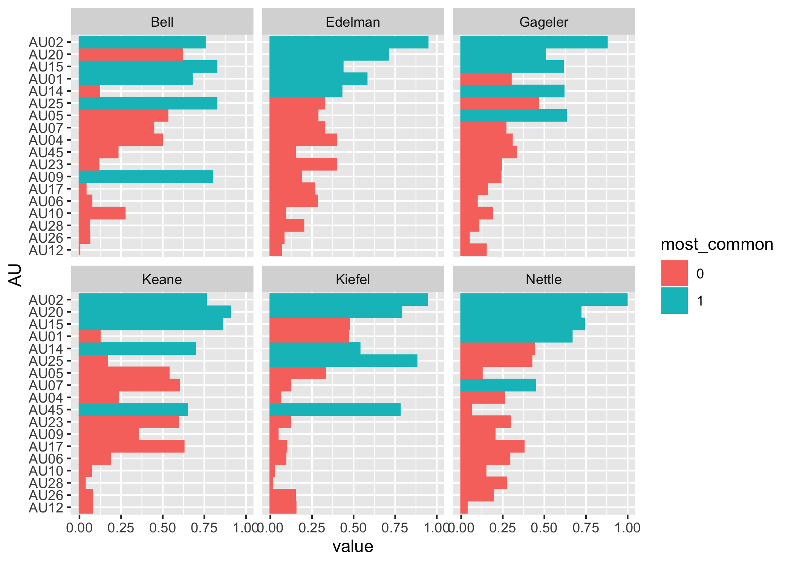
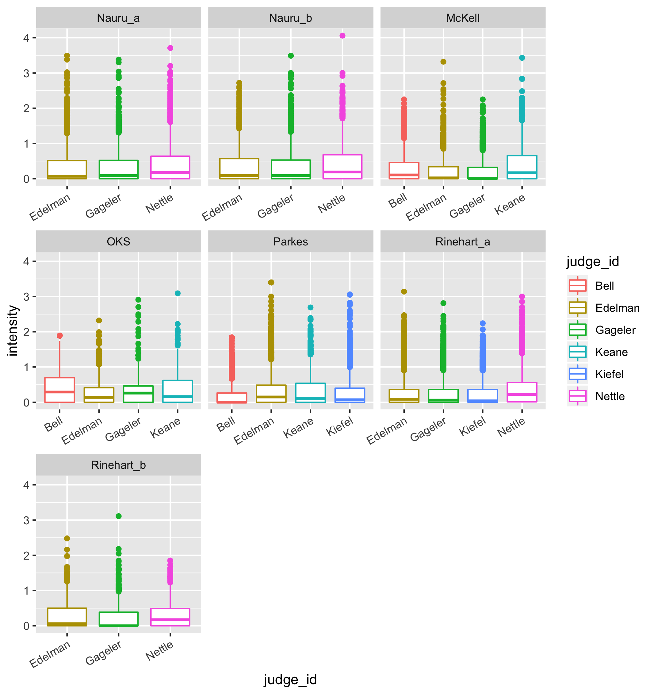

# Honours project: Exploration of Judicial Facial Expression in Videos and Transcripts of Legal Proceedings

## Stage 1: Obtaining data

The source data of the proeject are videos from the high court of Australia (http://www.hcourt.gov.au/cases/recent-av-recordings). Turning the video information into tidy facial data can be summarised through the following workflow: 

The revelent R code can be found in [2.Magick & OpenFace.Rmd](https://github.com/huizezhang-sherry/ETC4860/blob/master/2.Magick%20%26%20OpenFace.Rmd), [2.ffmpeg.Rmd](https://github.com/huizezhang-sherry/ETC4860/blob/master/2.ffmpeg.Rmd) and [3.0csv_proessing.Rmd](https://github.com/huizezhang-sherry/ETC4860/blob/master/3.0csv_processing.Rmd).

## Stage 2: Exploratory Data Analysis

### Missing value imputation 

The missingness in the dataset could be due to the fact that a judge is reading the materials on the desk so the face is not captured for a particular frame or simply because some faces are not detectable for the given resolution of the video stream. However, since that data is in time series structure, simply drop the missing observation will cause the time interval to be irregular and complicate further analysis. There are two different sets of variables that need imputation: the ones end with `_c`, which is binary and the ones end with `_r`, which is a float number. Linear interpolation from `forecast` package is suitable to impute the variables end with `_r` and I sample from binomial distribution to impute the variables end with `_c`. More details in [3.1missing.Rmd](https://github.com/huizezhang-sherry/ETC4860/blob/master/3.1missing.Rmd). 

### Exploratory data analysis

The obtained dataset has more than 700 variables for each of the 31 video-judge pairs. This outlines the difficulty of this project: no existing models will present accurate prediction and inference using 700+ variables - how can we incorporate these information to say about the facial expressions of the Justices during the hearings? 

I conduct some exploratory data analysis on one video: `Nauru_a` and find the 700+ variables can be classified as follows with some insights

 - **Confidence**: How confidence OpenFace is with the detection. Confidence is related to the angle that the Justice’s face present in the images. 
 
 - **Gaze**: Gaze tracking: the vector from the pupil to corneal reflection. The dataset contains information on the gaze for both eyes while there is no distinct difference between the eyes. Also I was trying to make animation to track the change of the gaze for judges but no good luck. 
 
 - **Pose**: the location of the head with respect to camera. Pose-related variables don't provide much useful information apart from gaze-related variables. 
 
 - **Landmarking**: landmarking variables for face and eyes. Landmarking variables allows me to plot the face of the judge in a particular frame. More work could be done to explore the usefulness of landmarking variables. 
 
 - **Action Unit**: Action units are used to describe facial expressions. More information can be find [here](https://github.com/TadasBaltrusaitis/OpenFace/wiki/Action-Units) and [this website](https://imotions.com/blog/facial-action-coding-system/) provides a good animation on each action unit. The action unit has intensity measures ending with `_c` and presence measures ending with `_r`. These variables will be the focus of my project and a reference study of using action units to detect human emotion by Kovalchik can be found [here](http://www.sloansportsconference.com/wp-content/uploads/2018/02/2005.pdf). 
 
 R markdown ducument [3.2EDA_nauru_a.Rmd](https://github.com/huizezhang-sherry/ETC4860/blob/master/3.2EDA_nauru_a.Rmd) records the analysis above. An extension to the full video EDA can be boudn [here](https://github.com/huizezhang-sherry/ETC4860/blob/master/3.3EDA.Rmd). 
 
### Text Analysis 

Text analysis conducted using the transcript strapped from the high court of Australia to study the interruptions by the justices. This is used as a benchmark to compare if facial information could help to understand more about Justices' decisions. See [3.5text&outcome.R](https://github.com/huizezhang-sherry/ETC4860/blob/master/3.5%20text%26outcome.R) for more details. 
 
## Stage 3: Action unit 

We answer the following few questions related to action unit 

**What are the most common action units for each judges?**

**How does the intensity of action units looks like?**

We can see that most of the action units have low intensity (the upper bounds of the box are at about one). 

**Does each Justice behave consistently in different trails or not?**

#### AU presence 

I first use simulation method to find the "normal" percentage of appearance of each AU for each Justices. The simulated mean percentage is then compared with the mean percentage appearance of each inidividual video to determine if an action unit appears considerably more or less than the "normal" level for each justices. The simulation and comparison procesure can be summarised as follows 

- step 1: Compute the simulated mean percentage from all the videos for each Justices 

\begin{align*} 
\mu_{i,k} = f(&x_{i,1,1,k}, x_{i,1,2,k}, \cdots, x_{i,1,T,k}\\
&x_{i,2,1,k},x_{i,2,2,k},\cdots ,x_{i,2,T,k} ... \\
&x_{i,J,1,k}, x_{i,J,2,k}, \cdots,x_{i,J,T,k} \\)
\end{align*}

where $f()$ is the function to compute the simulation. 

\begin{bmatrix}
\mu_{1,1} & \mu_{1,2} & \cdots & \mu_{1,k} \\
\mu_{2,1} & \mu_{2,2} & \cdots & \mu_{2,k} \\
\vdots & \vdots && \vdots \\
\mu_{6,1} & \mu_{6,2} & \cdots & \mu_{6,k} \\

\end{bmatrix}

- step 2: Compute the mean percentage appearance of each individual video as 
$$\frac{1}{T} \sum_{t = 1}^T x_{i,j,t,k} $$ for each combination of $(i, j, k)$

