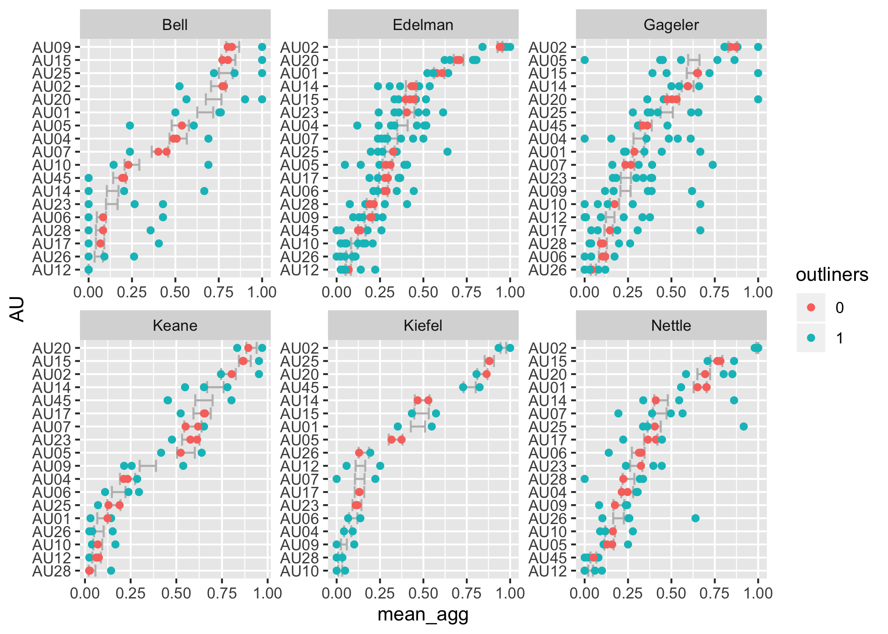

# Honours project: Exploration of Judicial Facial Expression in Videos and Transcripts of Legal Proceedings

## Stage 1: Obtaining data

The source data of the proeject are videos from the high court of Australia (http://www.hcourt.gov.au/cases/recent-av-recordings). Turning the video information into tidy facial data can be summarised through the following workflow: 

The revelent R code can be found in [2.Magick & OpenFace.Rmd](https://github.com/huizezhang-sherry/ETC4860/blob/master/2.Magick%20%26%20OpenFace.Rmd), [2.ffmpeg.Rmd](https://github.com/huizezhang-sherry/ETC4860/blob/master/2.ffmpeg.Rmd) and [3.0csv_proessing.Rmd](https://github.com/huizezhang-sherry/ETC4860/blob/master/3.0csv_processing.Rmd).

## Stage 2: Exploratory Data Analysis

### Missing value imputation 

The missingness in the dataset could be due to the fact that a judge is reading the materials on the desk so the face is not captured for a particular frame or simply because some faces are not detectable for the given resolution of the video stream. However, since that data is in time series structure, simply drop the missing observation will cause the time interval to be irregular and complicate further analysis. There are two different sets of variables that need imputation: the ones end with `_c`, which is binary and the ones end with `_r`, which is a float number. Linear interpolation from `forecast` package is suitable to impute the variables end with `_r` and I sample from binomial distribution to impute the variables end with `_c`. More details in [3.1missing.Rmd](https://github.com/huizezhang-sherry/ETC4860/blob/master/3.1missing.Rmd). 

### Exploratory data analysis

The obtained dataset has more than 700 variables for each of the 31 video-judge pairs. This outlines the difficulty of this project: no existing models will present accurate prediction and inference using 700+ variables - how can we incorporate these information to say about the facial expressions of the Justices during the hearings? 

I conduct some exploratory data analysis on one video: `Nauru_a` and find the 700+ variables can be classified as follows with some insights

 - **Confidence**: How confidence OpenFace is with the detection. Confidence is related to the angle that the Justice’s face present in the images. 
 
 - **Gaze**: Gaze tracking: the vector from the pupil to corneal reflection. The dataset contains information on the gaze for both eyes while there is no distinct difference between the eyes. Also I was trying to make animation to track the change of the gaze for judges but no good luck. 
 
 - **Pose**: the location of the head with respect to camera. Pose-related variables don't provide much useful information apart from gaze-related variables. 
 
 - **Landmarking**: landmarking variables for face and eyes. Landmarking variables allows me to plot the face of the judge in a particular frame. More work could be done to explore the usefulness of landmarking variables. 
 
 - **Action Unit**: Action units are used to describe facial expressions. More information can be find [here](https://github.com/TadasBaltrusaitis/OpenFace/wiki/Action-Units) and [this website](https://imotions.com/blog/facial-action-coding-system/) provides a good animation on each action unit. The action unit has intensity measures ending with `_c` and presence measures ending with `_r`. These variables will be the focus of my project and a reference study of using action units to detect human emotion by Kovalchik can be found [here](http://www.sloansportsconference.com/wp-content/uploads/2018/02/2005.pdf). 
 
 R markdown ducument [3.2EDA_nauru_a.Rmd](https://github.com/huizezhang-sherry/ETC4860/blob/master/3.2EDA_nauru_a.Rmd) records the analysis above. An extension to the full video EDA can be boudn [here](https://github.com/huizezhang-sherry/ETC4860/blob/master/3.3EDA.Rmd). 
 
### Text Analysis 

Text analysis conducted using the transcript strapped from the high court of Australia to study the interruptions by the justices. This is used as a benchmark to compare if facial information could help to understand more about Justices' decisions. See [3.5text&outcome.R](https://github.com/huizezhang-sherry/ETC4860/blob/master/3.5%20text%26outcome.R) for more details. 
 
## Stage 3: Action unit 

### Data Structure

The rest of the project focuses on the action unit related variables. If we write all the information in the matrix notation, every element will have four indices: `i` for `judge_id`; `j` for `video_id`; `t` for `frame_id` and `k` for `au_id`. Using the tidy principle, the data is in a tsibble format with `index = frame_id` and `key = c("judge_id, video_id)`. Different measurements on the presence and intensity of each action units are the variables. 

Assuming all the information can be summarised as a `Y` variable with multiple indices `(i,j,t,k)`. We can summarise the information via a linear combination of variables as [may need to refine this part ]

[more math here]

### What can we learn from the action unit data 

 - **What are the most common action units for each judges?**

Rank by judge_id: 

|index |Bell | Edelman| Gageler| Keane| Kiefel |Nettle|
|------|-----|-------|------|------|------|------|
|    1 |AU09 | AU02  | AU02 | AU20 | AU02 |AU02  |
|    2 |AU15 | AU20  | AU05 | AU15 | AU25 |AU15  |
|    3 |AU25 | AU01  | AU15 | AU02 | AU20 |AU20  |
|    4 |AU02 | AU14  | AU14 | AU14 | AU45 |AU01  |
|    5 |AU20 | AU15  | AU20 | AU45 | AU14 |AU14  |

It can be seen that AU02(outer eyebrow raise) and AU20(lip stretcher) are both common for all the judges. 

 - **How does the intensity of action units looks like?**

We can see that most of the action units have low intensity (the upper bounds of the box are at about one). 

notes:

There are predefined score for intensity 
A Trace
B Slight
C Marked or pronounced
D Severe or extreme
E Maximum

## Stage 4: Action unit within judge 

In this section, I use bootstrap simulation to answer the question 

- ***Does each Justice behave consistently in different trails or not?***

### AU presence 

I first use simulation method to find the "normal" percentage of appearance of each AU for each Justices. The simulated mean percentage is then compared with the mean percentage appearance of each inidividual video to determine if an action unit appears considerably more or less than the "normal" level for each justices. The simulation and comparison procesure can be summarised as follows 

- Step 1: Compute the simulated mean percentage  for each pair of  using bootstrapping. Below is an illustration of how bootstrap simulation is applied for *one particular* Justices-AU pair .

  - The replicates  for bootstrap simulation are drawn from 
  
  - The statistics to compute is the mean percentage: 

  - Simulation result for all Justices-AU pair can be written in the matrix notation as 

- Step 2: Compute the mean percentage appearance of each individual video  for each combination of 

The simulation result is presented here 

Todo: 
- maybe more interpretation on the result
- think about the strengh and weakness of the method

### AU Intensity

Todo: 
 - fill in this part 

## Stage 5: Action unit between Judge 

In this section, I use principle component analysis (PCA) to answer the question 

- ***Does the judges behave the same or different from one to another?***

The data is first pre-processed before being supplied into the PCA algorithm. For each judge-video-au pair, an average value across time `t` is first calculated. 

