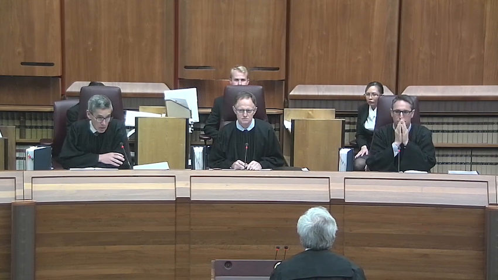
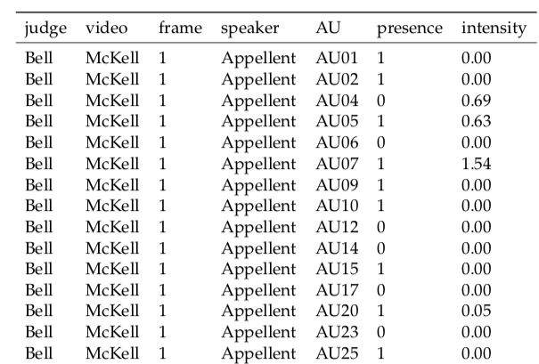

[](https://www.youtube.com/watch?v=Ae7uKzin0GA)

### Are the justices facial expression revealing the outcome of the case?

---
# Recent legal studies on judicial behaviour

- Tutton et al. (2018): 

  - studied judicial demenaur
  
  - Facial expressions were recorded manually  
  
  - This observational approach 
  
  - subjective when different people are observing the same videos

This motivates me to study the facial expression of the judge via an more objective approach by using facial recognition technology. 


---
# Face Recognition


- **Paul Ekman**: Facial Action Coding System (FACS)


- **Action units**: fundamental units of human facial muscles. 


.pull-left[

AU02 -	Outer eyebrow raiser

```{r echo = FALSE, message = FALSE, warning = FALSE}
library(knitr)
library(ggplot2)
library(emmeans)
library(tidyverse)
load("../raw_data/au_tidy.rda")
load("../raw_data/au_meaning.rda")
include_graphics("../images/AU2-right-only.gif")
```
]


.pull-right[

AU15 - Lip corner depressor

```{r echo = FALSE}

```
]

 - widely used in facial recognition software development and human emotion reseraches

---

class: inverse, center, middle

# Data Collection

---

## Video Processing

```{r echo = FALSE, fig.align="center", fig_height = 3.8, fig_width = 6.3}
include_graphics("../images/workflow.png", dpi = 128)
```

### 4601 faces and 711 facial variables!

---
class: middle, center


```{r echo = FALSE, warning=  FALSE}


```

---
class: inverse, center, middle

#  Method


---

## Notation: 

- $X_1$ indicates `judge` with six categories $i = 1,2, \cdots, 6$

- $X_2$ indicates `video` for each of the seven cases, $j = 1,2, \cdots, 7$

- $X_3$ indicates action unit containing `r length(unique(au_tidy$AU))` possible facial expression.  

- $X_4$ indicates `speaker`, either the appellant or respondent, $l=1,2$

- $X_5$ indicates `frame` corresponding to time, $t = 1,2, \cdots, T_j$

Main effects model: 

$$Y_{ijkl} = \mu + \alpha_i + \beta_j + \gamma_k + \delta_l + \varepsilon_{ijkl}$$ 

---

## Modelling:

\begin{equation}
P_{ijkl} = \mu + \alpha_i + \beta_j +\gamma_k + \delta_l + (\alpha\beta)_{ij} + (\alpha\gamma)_{ik} + (\beta\gamma)_{jk} + (\alpha\delta)_{il}
\end{equation}

Allow interaction between judge (`i`) and 

- video (`j`)
- action  unit (`k`)
- speaker (`l`)

and interaction between video $\times$ action unit. 

---
class: inverse, center, middle

#  Result


---

```{r echo = FALSE, message = FALSE, warning = FALSE, fig.height=9, fig.width=12}
model_dt <- au_tidy %>% 
  ungroup(judge) %>% 
  mutate(judge = fct_relevel(judge, "Edelman"), 
         AU = fct_relevel(AU, "AU01")) 

model_dt_2 <- model_dt %>% 
  filter(AU %in% c("AU02", "AU14", "AU20","AU15")) 

binomial_model_2 <- glm(presence ~ judge*video + judge*AU + video*AU, 
                        family = binomial(link = "logit"),  
                        data = model_dt_2)

lsmean_obj_2 <- emmeans(binomial_model_2, c("judge", "video", "AU"), 
                         type = "response") 

lsmean_obj_2 %>% 
  as.data.frame()%>%
  filter(!is.na(df)) %>% 
  mutate(judge = fct_relevel(judge, c("Edelman", "Keane", "Kiefel", "Nettle", "Gageler", "Bell"))) %>% 
  ggplot(aes(x= fct_relevel(video, c("Nauru-a", "Nauru-b", "Rinehart-a",
                               "Rinehart-b", "McKell", "OKS", "Parkes")), 
                            y = prob, col= video)) + 
  geom_point() + 
  geom_errorbar(aes(ymin = asymp.LCL, ymax = asymp.UCL), width = 0.2) + 
  facet_grid(AU ~ judge, scales = "free") + 
  theme(axis.text.x = element_text(angle = 30, hjust = 1)) + 
  xlab("video")
```

---

```{r echo = FALSE, message = FALSE, warning = FALSE, fig.height=9, fig.width=12}
model_dt_3 <- model_dt %>% 
  filter(AU %in% c("AU02", "AU14", "AU20","AU15")) 

binomial_model_3 <- glm(presence ~ judge*speaker + video*judge + AU*judge + video*AU, family = "binomial",  data = model_dt_3)

lsmean_obj_3 <-  emmeans(binomial_model_3, 
                         c("judge", "video", "AU", "speaker") , 
                         type = "response")

lsmean_obj_3 %>% 
  as.data.frame()%>%
  filter(!is.na(df)) %>% 
  mutate(judge = fct_relevel(judge, c("Edelman", "Keane", "Kiefel", 
                                      "Nettle", "Gageler", "Bell"))) %>% 
  ggplot(aes(x= fct_relevel(video, c("Nauru-a", "Nauru-b", "Rinehart-a",
                                     "Rinehart-b", "McKell", "OKS",
                                     "Parkes")), 
                            y = prob, 
             col = speaker)) + 
  geom_point() + 
  geom_errorbar(aes(ymin = asymp.LCL, ymax = asymp.UCL), width = 0.2) + 
  facet_grid(AU ~ judge, scales = "free") + 
  theme(axis.text.x = element_text(angle = 30, hjust = 1)) + 
  xlab("video")
```


---
class: center, middle

# Acknowledgement

I would like to express my gratitude to Di Cook and Russell Symth for supervising, Stephanie Kobakian and Stuart Lee for helping me throughout the project.

Slides created via the R package [**xaringan**](https://github.com/yihui/xaringan).


