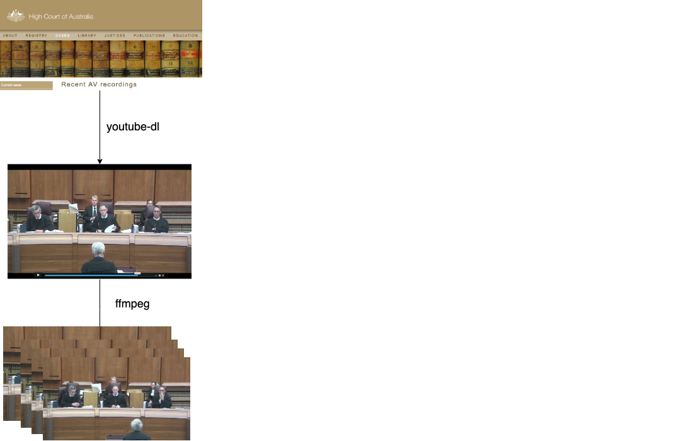
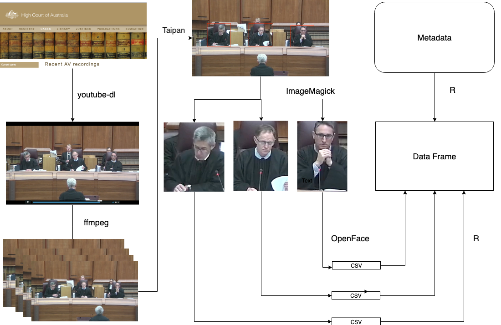

```{r setup, include = FALSE}
knitr::opts_chunk$set(echo = TRUE, 
                      warning = FALSE, 
                      message = FALSE,
                      cache = TRUE, 
                      fig.path = "Figures/", 
                      out.height = "500px", 
                      out.width = "700px", 
                      results = "asis")

library(knitr)
library(ggplot2)
library(emmeans)
library(tidyverse)
library(extrafont)

load("../raw_data/au_tidy.rda")
load("../raw_data/au_meaning.rda")
```

class: title-slide, center, middle

# `r rmarkdown::metadata$title`

### `r rmarkdown::metadata$author` 

### [`r icon::fa_twitter()`](https:://twitter.com/huizezhangsh) huizezhangsh [`r icon::fa_github()`](https:://github.com/huizezhang-sherry) huizezhang-sherry

###`r rmarkdown::metadata$institution`

---

[](https://www.youtube.com/watch?v=Ae7uKzin0GA)

### Are the justices facial expression revealing the outcome of the case?

---
# Recent legal studies on judicial behaviour


Judges are expected to be impartial in expressions presented to court. 

Tutton, Mack, Roach Anleu (2018):

- data collection: manual tagging of video footage of Australian High Court

- finding: judges present an impersonal or detached demeanour


--

Does automatic tagging of expressions using face recognition technology agree with this finding?


---
# Face Recognition


- **Paul Ekman**: Facial Action Coding System (FACS)


- **Action units**: fundamental units of human facial muscles. 


.pull-left[

AU02 -	Outer eyebrow raiser

```{r echo = FALSE, out.height="200px", out.width="350px"}
include_graphics("../images/AU2-right-only.gif")
```
]


.pull-right[

AU15 - Lip corner depressor

```{r echo = FALSE, out.height="200px", out.width="350px"}
include_graphics("../images/AU15.gif")
```
]

 - widely used in facial recognition software development and human emotion researches

---

class: inverse, center, middle

# Video Processing

---

```{r echo = FALSE, fig.align="center"}

```

---

```{r echo = FALSE, fig.align="center"}
include_graphics("../images/workflow_1 (1).png")
```

---

```{r echo = FALSE, fig.align="center"}
include_graphics("../images/workflow_1 (2).png")
```

---

```{r echo = FALSE, fig.align="center"}

```

---

```{r echo = FALSE, fig.align="center"}
include_graphics("../images/workflow_1 (4).png")
```

---

```{r echo = FALSE, fig.align="center",}

```

--

### 4601 faces and 711 facial variables!

---
class: middle, center


```{r echo = FALSE, warning=  FALSE}
include_graphics("../images/long.png")

```

---
class: inverse, center, middle

#  Method


---

## Notation: 

|Variable|Range|
|---|----|
|Judge| $i = 1,2, \cdots, 6$ |
|Video| $j = 1,2, \cdots, 7$ |
|Action unit|`r length(unique(au_tidy$AU))` possible facial expression|
|Speaker|either the appellant or respondent, $l=1,2$|
|Frame| $t = 1,2, \cdots, T_j$ |
|Presence |The binary $Y$ variable:  $P_{ijkl}$|


<!-- - $X_1$ indicates `judge` with six categories $i = 1,2, \cdots, 6$ -->
<!-- - $X_2$ indicates `video` for each of the seven cases, $j = 1,2, \cdots, 7$ -->
<!-- - $X_3$ indicates action unit containing `r length(unique(au_tidy$AU))` possible facial expression.   -->
<!-- - $X_4$ indicates `speaker`, either the appellant or respondent, $l=1,2$ -->
<!-- - $X_5$ indicates `frame` corresponding to time, $t = 1,2, \cdots, T_j$ -->
<!-- - $P_{ijkl}$ indicates the binary `presence` variable  -->


---

## Modelling:

GLM model with binomial link: 

\begin{aligned}
P_{ijkl} &= \frac{e^{\eta_{ijkl}}}{1 + e^{\eta_{ijkl}}} \\
\eta_{ijkl} &= \mu + \alpha_i + \beta_j +\gamma_k + \delta_l + (\alpha\beta)_{ij} + (\alpha\gamma)_{ik} + (\beta\gamma)_{jk} + (\alpha\delta)_{il} + \varepsilon_{ijkl}
\end{aligned}

<br>
where

- $\mu$ sets an overall mean

- $\alpha_i$, $\beta_j$, $\gamma_k$ and $\delta_l$ includes the effect of different judges, video, action unit and speaker

- The interaction term between judge ( $\alpha_i$) and video( $\beta_j$) allows different judges to react differently in different videos


---
class: inverse, center, middle

#  Result

---

```{r video-plot, echo = FALSE, message = FALSE, warning = FALSE, fig.width=16, fig.height=9}
model_dt <- au_tidy %>% 
  ungroup(judge) %>% 
  mutate(judge = fct_relevel(judge, "Edelman"), 
         AU = fct_relevel(AU, "AU01")) 

model_dt_2 <- model_dt %>% 
  filter(AU %in% c("AU02", "AU14", "AU20","AU15")) 

binomial_model_2 <- glm(presence ~ judge*video + judge*AU + video*AU, 
                        family = binomial(link = "logit"),  
                        data = model_dt_2)

emmean_obj_2 <- emmeans(binomial_model_2, c("judge", "video", "AU"), 
                         type = "response") 

int_2 <- confint(emmean_obj_2, adjust = "bonferroni")

int_2 %>% 
  filter(!is.na(df)) %>% 
  mutate(judge = fct_relevel(judge, c("Edelman", "Keane", "Kiefel", "Nettle", "Gageler", "Bell"))) %>% 
  ggplot(aes(x= fct_relevel(video, c("Nauru-a", "Nauru-b", "Rinehart-a",
                               "Rinehart-b", "McKell", "OKS", "Parkes")), 
                            y = prob,  group = judge)) + 
  geom_point(aes(col= video)) + 
  geom_line(alpha = 0.5, lty = "dashed") + 
  geom_errorbar(aes(ymin = asymp.LCL, ymax = asymp.UCL, col= video), 
                width = 0.2) + 
  facet_grid(AU ~ judge, scales = "free") + 
  theme(axis.text.x = element_text(angle = 90, hjust = 1, size= 15),
        legend.position = "bottom", 
        axis.text = element_text(size = 15), 
        strip.text.x = element_text(size = 15),
        strip.text.y = element_text(size = 15)) + 
  xlab("video")
```

---
## Discussion

- Generally the judges expressions are the same regardless of video

- Nettle always has a raised outer eyebrow (AU02)

- Gageler and Bell reacted strongly to the OKS case, but Edelman and Keane did not

---

## Packages used in the research include: 

- [**tidyverse**](https://CRAN.R-project.org/package=tidyverse) for data manipulation and plotting

- [**emmeans**](https://CRAN.R-project.org/package=emmeans) for producing customised model output 

- [**youtube-dl**](https://ytdl-org.github.io/youtube-dl/index.html) for video downloading

- [**ffmpeg**](https://www.ffmpeg.org/) for video processing

- [**Taipan**](https://github.com/srkobakian/taipan) for image annotation

- [**ImageMagick**](https://imagemagick.org/index.php) for image processing

- [**OpenFace**](https://github.com/TadasBaltrusaitis/OpenFace) for facial recognition

---
class: center, middle

# Acknowledgement

I would like to express my gratitude to Di Cook and Russell Symth for supervising, Stephanie Kobakian and Stuart Lee for helping me throughout the project.


Slides created via the R package [**xaringan**](https://github.com/yihui/xaringan).


