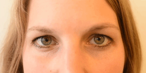

# Results

<!-- ## Action unit: Presence  -->
## Model 1: Action unit


### Mean presence score and most common action units 

The average presence ($P_{ik}$) of each action unit is first computed for each judge as $$P_{ik} = \frac{\sum_{jt}X_{ijtk}}{\sum_{j = 1}^JT_j}$$ This is then plotted in Figure \ref{fig:mean_presence} to give an overview of the presence score of all the action units across all the judges. The order of action unit on the y axis is ranked by the average presence of all the judges. The five most frequent action units are highlighted in blue for each judge and summarised in Table \ref{tab:most_common}

```{r most-common, fig.cap="The average presence score of each action unit for each judge, aggregating on video and time. \\label{fig:mean_presence}"}
# Because each judge has different numbers of frame available, mean is a better way ,than sum/ count,  to discribe the frequency of occurence. 

most_common <- au_tidy %>% 
  group_by(judge,AU) %>% 
  summarise(avg_presence = mean(presence)) %>% 
  filter(avg_presence != "NaN") %>% 
  group_by(judge) %>% 
  arrange(-avg_presence) %>% 
  mutate(common = row_number()) %>% 
  mutate(most_common = as_factor(ifelse(common <=5, 1, 0))) %>% 
  left_join(au_meaning, by = c("AU" = "AU_number")) %>% 
  mutate(AU = as.factor(AU))

most_common %>% 
  ggplot(aes(x =  fct_reorder(AU, avg_presence), y = avg_presence,
             fill = most_common, col = most_common)) + 
  geom_col() +
  xlab("AU") + 
  ylab("Average Presence") + 
  facet_wrap(vars(judge)) + 
  coord_flip() + 
  theme(legend.position = "none")
```

```{r most-common-table}
kable(most_common %>% 
        filter(most_common ==1) %>% 
        dplyr::select(judge, AU) %>% 
        mutate(index = row_number()) %>% 
        spread(judge, AU), 
      caption = "\\label{tab:most_common}The five most commonly presented action units for each judge.")
```

It can be seen that some of the action units are common across almost all the judges, these includes 

- AU02 (outer eyebrow raise), 
- AU20 (lip stretcher), 
- AU15 (Lip Corner Depressor) 
- AU14 (Dimpler)

According to @ekman2002facial, AU02 makes a contribution to surprise, which may be a positive attitude showing that judges are interested in a particular moment. AU14 indicates boredom and AU15 shows confusion. Based on the most common five action units, the emotions judges displayed in the courtroom can be summarised into three categories, described in Table \ref{tab:three_category}, along with the featured action units. 


```{r emotion-table}
tibble::tibble(emotion = c("Surprise", "Boredom", "Confusion"), 
               `Featured Action Unit` = c("AU01, AU02, AU05", 
                                          "AU14, AU23", 
                                          "AU07, AU15, AU23")) %>% 
  kable(caption = "\\label{tab:three_category}Summarised emotions and featured action units")
```

<!-- this table may not be useful while add confusion -->
<!-- ```{r} -->
<!-- other_highf <- most_common %>%  -->
<!--   filter(most_common ==1) %>%  -->
<!--   dplyr::select(-c(common, most_common, avg_presence, Muscle)) %>%  -->
<!--   filter(!AU %in% c("AU02", "AU20", "AU15", "AU14")) %>%  -->
<!--   mutate(index = row_number()) %>%  -->
<!--   dplyr::select(-AU) %>%  -->
<!--   spread(index, AU_meaning) %>%  -->
<!--   rename(first = `1`, second = `2`, third = `3`) -->

<!-- knitr::kable(other_highf, caption = "\\label{tab:other_highf} Other high frequent action units ") -->
<!-- ``` -->


### Number of action unit to include in the model 

The number of action unit to include in the model is a matter of choice. Including too many action units will cause the model to run out of degree of freedom while too few action units will cause the model not being able to explain an adequate amount of data. The goal of picking this number is to make sure our model is parsimonious, that is, a model with the smallest number of variables but with greatest explanatory power. 

The action units with low average percentage of appearance are not particularly of our interest in modelling, thus we set a threshold of 25% [discuss about the rigrousness of this!!!]. Notice that for the same action unit some judges would have an over 25% average percentage but others maynot, thus we also want to limit the action units to those that have over-25% average percentage of appearance for most judges. 

We plot the number of action unit aginst number of judges having the average percentage of appearance over 25% in Figure \ref{fig:number-au}. This allows us to find the action units that most of the judges have a reasonable appearance. 

```{r number-au, fig.cap="The number of action unit aginst number of judges having the average percentage of appearance over 25\\%."}


compute_au_number <- function(cutpoint){
  count <- most_common %>% ungroup() %>%
  filter(avg_presence > 0.25) %>% group_by(AU) %>%
  summarise(count = n()) %>% filter(count >=cutpoint) %>% ungroup() %>%
    pull(AU) %>% length()
  return(count)
}

# number of action unit to include against
# number of judges that has the action unit average intensity to be greater than 0.25
tibble(cutpoint = 1:6,
       count = map_dbl(cutpoint, compute_au_number)) %>%
  ggplot(aes(x = cutpoint, y = count, fill = count)) +
  geom_col() +
  geom_text(aes(label = count),nudge_y = 0.5, col = "red") +
  scale_x_continuous(breaks = seq(1,6,1))


common_au <- most_common %>% ungroup() %>%
  filter(avg_presence > 0.25) %>% group_by(AU) %>%
  summarise(count = n()) %>% filter(count >=5) %>% pull(AU)
```

In this plot, the bar with  cutpoint being six means there are only three action units with all the six judges have average appearane percentage greater than 25%. We can see that there is a huge decrease in the number action unit from cutpoint of five to six judges. 

The choose of number of action unit could be similar to choosing the number of principle component based on the proportion of explained varariance in the screen plot from principle component analysis. Therefore, we choose the cutoff point at 5, which allows our model to include eight action units. The included action units are `r print(common_au)` and their average presence score are plotted in Figure \ref{fig:selected-au} where the color indicates whether the average percentage is above the 25% threshold.  

```{r selected-au, fig.cap="The eight action units with at least five judges having average presence score over 25\\%."}

# average presence score for the action unit where at least 5 judges has average presence score greater than 0.25
most_common %>%
  filter(AU %in% common_au) %>%
  mutate(less = as.factor(ifelse(avg_presence > 0.25, 0, 1))) %>%
  ggplot(aes(x = AU, y = avg_presence,
             col = less, fill = less)) +
  geom_col() +
  xlab("AU") +
  ylab("Average Presence") +
  facet_wrap(vars(judge)) +
  coord_flip() +
  theme(legend.position = "none")
```


```{r}
model_dt <- au_tidy %>%
  ungroup(judge) %>%
  filter(AU %in% common_au) %>%
  mutate(judge = fct_relevel(judge, "Bell"),
         AU = fct_relevel(AU, "AU01"))
```


### Model summary

The estimated marginal mean is computed in Table \ref{tab:result_1} after modelling.  This output can be easily interpreted as the estimated probability with its confidence interval. For example, the first row can be interpreted as follows: After averaging over all the videos and speaking parties, the estimated mean probability for judge Edelman in action unit AU02 is 0.95, with a 95% confidence interval of [0.92, 0.97]. Notice that  confidence intervals for a generalised linear model is asymmetric around the estimates because the linear symmetric interval of the mean need to be transferred via the inverse of link function to get the confidence interval for the response. 

```{r model_1}
binomial_model_1 <- glm(presence ~ judge*AU,
                        family = binomial(link = "logit"),
                        data = model_dt)

emmean_obj_1 <-  emmeans(binomial_model_1, ~judge*AU, type = "response")
int_1 <- confint(emmean_obj_1, by = "judge",adjust = "bonferroni") %>% as.data.frame() %>% dplyr::select(-df)


# result_1 <- multcomp::cld(lsmean_obj_1, alpha = 0.05, type = "response") 
```

```{r model_1_response, results = "asis"}
knitLatex::xTab(format(int_1, digits = 2), booktabs = TRUE, caption.top = "\\label{tab:result_1}Estimated marginal mean summary for Model 1. The confidence interval is adjusted using bonferroni adjustment")
```
<!-- A bit more work on  -->
<!-- 1) how the glm standard error is computed:  -->
<!-- ```{r} -->
<!-- o <- glm(y ~ x, data = dat) -->
<!-- std.er <- sqrt(t(C) %*% vcov(o) %*% C) -->
<!-- # check if it is the same as pred$se.fit -->
<!-- pred <- predict(o, newdata = data.frame(x=1.5), se.fit = TRUE) -->
<!-- ``` -->

<!-- 2) if HC estimator of sigma is needed  -->
<!-- 3) if adjustment is needed for clusteringstandard error:  -->
<!-- http://civil.colorado.edu/~balajir/CVEN6833/lectures/GLM-theory-notes.pdf -->
<!-- http://civil.colorado.edu/~balajir/CVEN6833/lectures/glm-estimation-presentation.pdf -->
<!-- https://stats.stackexchange.com/questions/332077/glm-standard-errors -->


The Type III Analysis of Variance (ANOVA) test is conducted with the result shown in Table \ref{tab:anova-1}. It can be seen that judge, AU and their interactions are all significance, which validates our choice of Type III instead of Type II ANOVA. 

```{r anova-1}
Anova(binomial_model_1, type = "III", singular.ok = TRUE) %>% 
  format(digits = 2) %>% 
  kable(caption = "\\label{tab:anova-1}Type III ANOVA table for model 1. All the variables are significant.")
```

Multiple comparison is then performed and the 95% confidence interval after bonferroni adjustment is plotted in Figure \ref{fig:model1-plot}. This plot shows that the interval for the judges are significantly different from one to another as most of the intervals are not overlapping with each other. This confirms the necessity of including the interaction terms. 

```{r model1-plot, fig.cap="The confidence interval for estimated mearginal mean in model 1"}
int_1 %>%
  left_join(au_meaning, by = c("AU" = "AU_number")) %>%
  as_tibble()%>%
  filter(!is.na(df)) %>%
  ggplot(aes(x= AU,y = prob, fill = AU)) +
  geom_point() +
  geom_errorbar(aes(ymin = asymp.LCL, ymax = asymp.UCL), width = 0.2) +
  facet_wrap(vars(judge))  +
  coord_flip() +
  xlab("AU") +
  theme(legend.position = "none")
```

\newpage

## Model 2: Video

### Presence by videos

We are also interested in the main presence score of the judges by video ($P_{ijk}$). This is computed as $$P_{ijk} = \frac{\sum_{t}X_{ijtk}}{T_j}$$ for the four most common action units: AU02, AU14, AU15, AU20 and plotted in Figure \ref{fig:common_video}. From this plot, we can observe that judge Gageler, who is coloured as green, has a much higher proportion of expression in case OKS, especially in action unit 14, 15 and 20. judge Bell, who is coloured red also has large fluctuation in case Parkes for action unit 14 and 20. In the next section, I will model the presence score by incorporating the video information to see if the model tells us the same. 

```{r au-video, fig.cap="Average presence of the four most common action units for each judge by video\\label{fig:common_video}"}
more_presence <- au_tidy %>% 
  group_by(judge,AU, video) %>% 
  summarise(avg_presence = mean(presence)) %>% 
  filter(avg_presence != "NaN") %>% 
  arrange(-avg_presence) %>% 
  ungroup(judge) %>% 
  left_join(au_meaning, by = c("AU" = "AU_number")) %>% 
  mutate(AU = as.factor(AU))

more_presence %>% 
  filter(AU %in% common_au) %>%
  ggplot(aes(x = video, y = avg_presence, 
             group = judge, col = judge)) + 
  geom_line() + 
  geom_point() + 
  facet_wrap(vars(AU_meaning),scales = "free_x") + 
  theme(axis.text.x = element_text(angle = 30, hjust = 1))
```

### Model summary

The estimated marginal mean for the second model are presented in Table \ref{tab:result-2} in the Appendix due to its length. ANOVA test (Tab \ref{tab:anova-2}) and multiple comparison is conducted as described before. Figure \ref{fig:model2-plot} presents the 95% confidence interval for each estimated marginal mean based on model 2. 

We can observe that Judge Edelman, Keane and Kiefel behave relatively consistent throughout all the videos since all the intervals overlap with each other after the  bonferroni adjustment. This would indicates in these videos, these judges would have similar thinking or reaction towards the evidence and argument presented by the barristers.  

Judge Gageler seems to have a large fluctuate of his facial expressions in video OKS and his response is significantly different from those in other cases for action unit 14, 15 and 20. This shows consistency with our exploratory data analysis where Gageler tends to show a higher proportion of presence for action units in case OKS. 

For Judge Bell, her behaviour is much more fluctuate than all other judges. In the same Figure \ref{fig:model2-plot}, Bell shows significantly more expressions in action unit 14, 15 and 20 for case OKS and Parker, which validates the previous exploratory data analysis. From a legal perspective, this would show that Bell is addressing the cases with different responses. However, this different approach of responding by the judge doesn't indicate the biasness of the judge in the courtroom but the individuality of different judge approaching to cases. 


```{r model-2, results = "asis"}
binomial_model_2 <- glm(presence ~ judge*video + judge*AU + video*AU,
                        family = binomial(link = "logit"),
                        data = model_dt)

emmean_obj_2 <- emmeans(binomial_model_2, c("judge", "video", "AU"),
                        type = "response")

int_2 <- confint(emmean_obj_2, by = c("judge", "AU"), adjust = "bonferroni") # the by argument prescribe

```

```{r anova-2}
Anova(binomial_model_2, type = "III", singular.ok = TRUE) %>% 
  format(digits = 2) %>% 
  kable(caption = "\\label{tab:anova-2}Type III ANOVA table for model 2. All the variables are significant.")
```

```{r model2-plot, fig.cap="The confidence interval for estimated mearginal mean in model 2"}
int_2 %>% 
  left_join(au_meaning, by = c("AU" = "AU_number")) %>% 
  dplyr::select(-Muscle) %>% 
  filter(!is.na(df)) %>% 
  mutate(judge = fct_relevel(judge, c("Edelman", "Keane", "Kiefel", 
                                      "Nettle", "Gageler", "Bell"))) %>% 
  ggplot(aes(x= fct_relevel(video, c("Nauru_a", "Nauru_b", "Rinehart_a",
                               "Rinehart_b", "McKell", "OKS", "Parkes")), 
                            y = prob,  group = judge)) + 
  geom_point(aes(col= video)) + 
  geom_line(alpha = 0.5, lty = "dashed") + 
  geom_errorbar(aes(ymin = asymp.LCL, ymax = asymp.UCL, col= video), 
                width = 0.2) + 
  facet_grid(AU_meaning ~ judge, scales = "free",
             labeller = label_wrap_gen(width = 5)) + 
  theme(axis.text.x = element_text(angle = 90, hjust = 1), 
        strip.text.y = element_text(angle = 0),
        legend.position = "none") + 
  xlab("video")

```      

## Model 3: Speaker
### Model summary

The estimated marginal mean are presented in Table \ref{tab:result-3} in the Appendix and plotted in Figure \ref{fig:model3-plot}. ANOVA table in Tab \ref{tab:anova-3} SAYS BLABLABLA. We can observe that the video-wise difference between judge still persist and the speaker-wise difference is not significant. This result would be a validation that on the high court level, the judges are behaving impartial to different speaking parties. 
  
<!-- - ANOVA tests suggest all the variables in model_1 and model_2 are significant individually, but speaker in model_3 is not significant at 5% significant level. -->
  

```{r model_3, results = "asis"}
binomial_model_3 <- glm(presence ~ judge*speaker + video*judge +
                          AU*judge + video*AU, family = "binomial",
                        data = model_dt)

emmean_obj_3 <-  emmeans(binomial_model_3,
                         c("judge", "AU", "speaker", "video") ,
                         type = "response",weights = "cell")

# interesting that speaker is not significant, but speaker*judge is
# given the interactions, speaker is not significant but it still useful because
# the interactions are significant
int_3 <- confint(emmean_obj_3, by = c("judge", "AU"),adjust = "bonferroni")
```


```{r anova-3}
Anova(binomial_model_3, type = "III", singular.ok = TRUE) %>% 
  format(digits = 2) %>% 
  kable(caption = "\\label{tab:anova-3}Type III ANOVA table for model 3. NEED TO REWRITE HERE.")
```


```{r model3-plot, fig.cap = "The confidence interval for estimated mearginal mean in model 3"}
int_3 %>% 
  filter(!is.na(df)) %>% 
  ggplot(aes(x= fct_relevel(video, c("Nauru_a", "Nauru_b", "Rinehart_a",
                               "Rinehart_b", "McKell", "OKS", "Parkes")), 
             y = prob, group= judge)) + 
  geom_point(aes(col = speaker),position = position_dodge(width = 0.3)) + 
  geom_line(alpha = 0.5, lty = "dashed") + 
  geom_errorbar(aes(ymin = asymp.LCL, ymax = asymp.UCL, col = speaker), 
                width = 0.2,position = position_dodge(width = 0.3)) + 
  facet_grid(AU ~ fct_relevel(judge, c("Edelman", "Keane", "Kiefel", "Nettle", "Gageler", "Bell")), scales = "free") + 
  theme(axis.text.x = element_text(angle = 30, hjust = 1)) + 
  xlab("video")


```


## Action unit: Intensity

### General Intensity  plot

In Ekman's 20002 FACS manual, the intensity of an action unit is defined based on five classes: Trace: 0-1, Slight: 1-2, Marked or pronounced: 2-3, Severe or extreme: 3-4 and Maximum: 4-5. 

The boxplot of the intensity for all the judges across all the videos is presented in Figure \ref{fig:intensity}. Each bar-and-whisker represents the intensity ($I_{ijtk}$) of all the action units aggregated on time for a particular judge $i$ in a specific case $j$. For example, the first bar-and-whisker in case Nauru_a is created using all the 17 action units of Edelman through out the elapsed time in Nauru_a case.

From the plot, we can see that most of the action units have low intensity score and this is expected because usually judges are expected to behave neutral in the court room. Thus a square root transformation is taken on the y axis for better visualisation effect. We can find that Judge Nettle seems to have higher average in all the four cases he appears: Nauru_a&b, Rinehart_a &b. 

```{r intensity-boxplot, fig.cap="General intensity score by judge and video\\label{fig:intensity}"}
au_intensity_all <- au_tidy %>% 
  mutate(is_intense = ifelse(intensity >= 2, 1, 0))  

# intensity plot
#au_intensity_all %>% 
#  ggplot(aes(x = judge, y = intensity, color = judge)) + 
#  geom_boxplot() + 
#  facet_wrap(vars(video), scales = "free_x") + 
#  theme(axis.text.x = element_text(angle = 30, hjust = 1), 
#        legend.position = "none")

# the plot magnify the box
au_intensity_all %>% 
  ggplot(aes(x = judge, y = intensity, color = judge)) + 
  geom_boxplot(coef = 100) + 
  facet_wrap(vars(video), scales = "free_x") + 
  theme(axis.text.x = element_text(angle = 30, hjust = 1), 
        legend.position = "none") + 
  scale_y_sqrt()

``` 
 
### Mean intensity 

Mean intensity score ($I_{ik}$) of each action unit for each of the judge is computed as $$I_{ik} = \frac{\sum_{jt}X_{ijtk}}{\sum_{j = 1}^JT_j}$$ and plotted in Figure \ref{fig:mean_intensity}. The five most intense action units for each judge are presented in Table \ref{tab:most_intense}. We can find that the common high intense action units includes 

```{r AU-gif}
# include_graphics("figures/AU20-lip-stretcher.gif", dpi = 128)
# 
# 
```

- AU20 (Lip Stretcher)
- AU07 (Lid Tightener)
- AU04 (Brow Lower)

AU04 also belongs to the confusion category as AU07. This could help to understand that judges are more likely to express a stronger confusing expression than other emotions. 


```{r mean-intensity, fig.cap="Mean intensity score for each judge and action unit aggregating on videos.\\label{fig:mean_intensity}"}
most_intense <- au_intensity_all %>% 
  filter(!AU == "AU28") %>%  # AU28 doesnt have intensity score
  group_by(judge, AU) %>% 
  summarise(mean_intensity = mean(intensity, na.rm = TRUE)) %>% 
  arrange(-mean_intensity) %>% 
  mutate(index = row_number(), 
         most_intense = as.factor(ifelse(index <= 5, 1,0))) 

most_intense%>% 
  ggplot(aes(x = fct_reorder(AU, mean_intensity), 
             y = mean_intensity, 
             fill = most_intense)) + 
  geom_col() + 
  facet_wrap(vars(judge)) + 
  coord_flip()
```  
 


```{r intensity-table}
knitr::kable(most_intense %>% 
  filter(most_intense ==1) %>% 
  dplyr::select(c(judge, AU)) %>% 
  mutate(index = row_number()) %>% 
  spread(judge, AU), caption = "\\label{tab:most_intense}The five most intense action unit for each judge.")
```
 
### Model fit 

```{r intensity-model, eval = FALSE}
model_dt %>% 
  filter(intensity != 0)%>% 
  mutate(intensity = sqrt(intensity)) %>% 
  ggplot(aes(x = intensity)) + 
  geom_histogram()

model_dt %>% 
  ggplot(aes(x = sqrt(intensity))) + 
  geom_histogram()

model_dt %>% 
  ggplot(aes(x = intensity)) + 
  geom_histogram()

# square root transformation
model_dt %>% mutate(intensity = (intensity - mean(intensity))/sd(intensity)) %>% 
  ggplot(aes(x = intensity)) + 
  geom_histogram()
```


### Intensity plot for the most frequent action units
 
Apart from visualising the general intensity score for all the action units, I'm also interested in the intensity score of the most frequent action units. Figure \ref{fig:intensity_by_au} presents this. The statistics being plotted is $I_{ijtk}$ with $k$ including AU02, AU14, AU15 and AU20 as the most common four action units. From this plot, we can learn that AU02, although being commonly detected for all the judges, has low intensity score. 


```{r intensity-most-frequent, fig.cap = "Intensity score of the most frequent action units, seperating by judge and video ID.\\label{fig:intensity_by_au}"}

# plot for four major high frequent action units
au_intensity_all %>% 
  left_join(au_meaning, by = c("AU" = "AU_number")) %>% 
  mutate(AU = as.factor(AU)) %>% 
  filter(AU %in% c("AU02", "AU14", "AU15", "AU20")) %>% 
  ggplot(aes(x = video, y = intensity, col = video)) + 
  geom_boxplot() + 
  facet_grid(rows = vars(AU_meaning),
             cols = vars(judge), scales = "free_x") + 
  theme(legend.position = "none",
        axis.text.x = element_text(angle = 30, hjust = 1))

# plot for other high frequent action units
# intensity_subset_plot <- function(judge){
#   intensity_subset %>% 
#     filter(!AU %in% c("AU02", "AU14", "AU15", "AU20")) %>% 
#     filter(judge == judge) %>% 
#     ggplot(aes(x = video, y = intensity, col = video)) + 
#     geom_boxplot() + 
#     facet_grid(rows = vars(judge),
#                cols = vars(AU), scales = "free_x") + 
#     ylim(c(0,4)) + 
#     theme(legend.position = "none",
#           axis.text.x = element_text(angle = 30, hjust = 1))
# }
# 
#   
# judge <- unique(intensity_subset$judge)
# subplot <- map(judge, intensity_subset_plot)  
# 
# 
# ggarrange(subplot[[1]], 
#           subplot[[2]],
#           subplot[[5]],
#           subplot[[6]],
#           subplot[[3]],
#           subplot[[4]],
#           ncol = 2, nrow = 3)

```
 
### High intensity points

We filter out the points have intensity greater than 2  (at least "slight" as per Ekman) in the previous plot and plot it against time and color by the speaker. It tells us that Edelman, Gageler and Nettle are the judges have stronger emotion that can be detected (since they have more points with intensity greater than 2). Different judges also have different time where they display stronger emotions. For example, Justice Nettle are more likely to have stronger emotion throughout the time when the appellant is speaking but only at the beginning and ending period when the respondent is speaking.

```{r high-intensity-points}
au_intensity_all %>% filter(is_intense ==1) %>% 
  ggplot(aes(x = frame, y = intensity, col = speaker)) + 
  geom_point() +
  facet_wrap(vars(judge))
```

