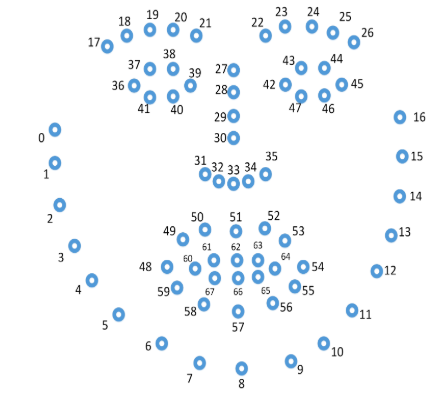

\appendix

# Appendix

## List of videos used in the project

|Case|Name|AV recording link|Judge|
|---|--|----|---|
|The Republic of Nauru v WET040 [No. 2] [2018] HCA 60|`Nauru_a`|http://www.hcourt.gov.au/cases/cases-av/av-2018-11-07a|Nettle, Gageler, Edelman|
|TTY167 v Republic of Nauru [2018] HCA 61|`Nauru_b`|http://www.hcourt.gov.au/cases/cases-av/av-2018-11-07b|Nettle, Gageler, Edelman|
|Rinehart v Hancock Prospecting Pty Ltd [2019] HCA 13|`Rinehart_a`|http://www.hcourt.gov.au/cases/cases-av/av-2018-11-13|Gordon, Gageler, Bell, Keane, Edelman|
|Rinehart v Hancock Prospecting Pty Ltd [2019] HCA 13|`Rinehart_b`|http://www.hcourt.gov.au/cases/cases-av/av-2018-11-14a|Gordon, Keane, Bell, Gageler, Edelman|
|Parkes Shire Council v South West Helicopters Pty Limited [2019] HCA 14|`Parkes`|http://www.hcourt.gov.au/cases/cases-av/av-2018-11-14b|Gordon, Bell, Kiefel, Keane, Edelman|
|McKell v The Queen [2019] HCA 5|`McKell`|http://www.hcourt.gov.au/cases/cases-av/av-2018-12-07|Gordon, Gageler, Kiefel, Nettle, Edelman|
|OKS v Western Australia [2019] HCA 10|`OKS`|http://www.hcourt.gov.au/cases/cases-av/av-2019-02-14|Gordon, Gageler, Kiefel, Nettle, Edelman|

Table: Details of videos processed.

## An illustration of face landmarking

```{r landmarking, fig.cap="This is an illustration of the face landmarking where 67 key points on a face is identified. "}

```

## Description of action units recognised by OpenFace

```{r au, results='asis'}
au <- au_meaning %>% rename(`AU-number` = AU_number, `AU-meaning` = AU_meaning)

knitLatex::xTab(au, booktabs = TRUE, caption.top = "\\label{tab:au} The subset of action units OpenFace is able to recognise.")

```


## Model estimation result


```{r result-2, results = "asis"}
knitLatex::lTab(format(int_2 %>% filter(!is.na(prob)) %>% dplyr::select(-df), digits = 2), booktabs = TRUE, caption.firsthead = "\\label{tab:result-2}model result 2 for mean presence")
```


```{r intensity-result-2, eval = FALSE, results = "asis"}
knitLatex::lTab(format(int_2i %>% filter(!is.na(response)) %>% dplyr::select(-df), digits = 2), booktabs = TRUE, caption.firsthead = "\\label{intensity-result-2}model result 2 for mean intensity")
```


```{r model3-plot, fig.cap="The confidence interval for estimated mearginal mean in model 3"}
emmean_obj_3 <- emmeans(binomial_model_3, c("judge", "video", "AU", "speaker"),
                        type = "response")

int_3 <- confint(emmean_obj_3, by = c("judge", "AU"), adjust = "bonferroni")

int_3 %>%
  left_join(au_meaning, by = c("AU" = "AU_number")) %>%
  filter(!is.na(df)) %>%
  ggplot(aes(x= video,y = prob,group= judge)) +
  geom_point(aes(col = speaker),position = position_dodge(width = 0.3)) +
  geom_line(alpha = 0.5, lty = "dashed") +
  geom_errorbar(aes(ymin = asymp.LCL, ymax = asymp.UCL, col = speaker),
                width = 0.2,position = position_dodge(width = 0.3)) +
  facet_grid(AU_meaning ~ judge, scales = "free",
             labeller = label_wrap_gen(width = 5)) +
  theme(axis.text.x = element_text(angle = 90, hjust = 1),
        strip.text.y = element_text(angle = 0),) +
  xlab("video")

```   

```{r intensity-speaker, fig.cap="The confidence interval for estimated mearginal mean in model 3"}

m1 <- glm(non_zero ~ judge*video + judge*AU + video*AU + judge * speaker,
          data = model_dt, family = binomial(link = "logit"))
m2 <- glm(intensity ~ judge*video + judge*AU + video*AU + judge * speaker,
          data = subset(model_dt, non_zero == 1),
          family = Gamma(link = "log"))

emmean_m2 <-  emmeans(m2, c("judge", "video", "AU", "speaker"), type = "response")
int_3i <- confint(emmean_m2, by = c("judge", "AU"), adjust = "bonferroni") # the by argument prescribe
int_3i %>%
  left_join(au_meaning, by = c("AU" = "AU_number")) %>%
  filter(!is.na(df)) %>%
  ggplot(aes(x= video,y = response,group= judge)) +
  geom_point(aes(col = speaker),position = position_dodge(width = 0.3)) +
  geom_line(alpha = 0.5, lty = "dashed") +
  geom_errorbar(aes(ymin = asymp.LCL, ymax = asymp.UCL, col = speaker),
                width = 0.2,position = position_dodge(width = 0.3)) +
  facet_grid(AU_meaning ~ judge, scales = "free",
             labeller = label_wrap_gen(width = 5)) +
  theme(axis.text.x = element_text(angle = 90, hjust = 1),
        strip.text.y = element_text(angle = 0),) +
  xlab("video")
```
